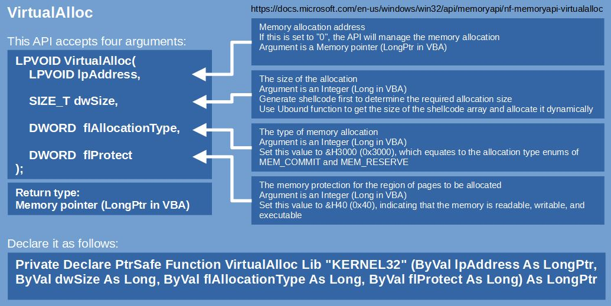
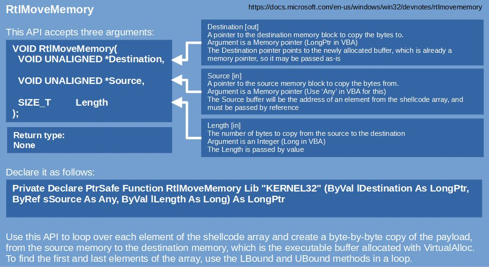
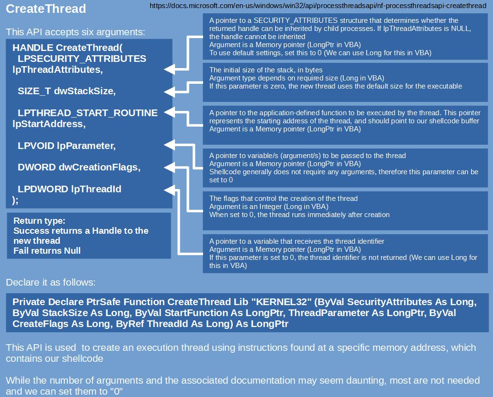

# VBA Shellcode Runner

A shellcode runner is a piece of code that executes shellcode in memory. The typical approach is to use the following three Win32 APIs from Kernel32.dll:&#x20;

> VirtualAlloc --> allocate unmanaged memory that is readable, writable and executable
>
> RtlMoveMemory --> copy the shellcode into the newly allocated memory
>
> CreateThread --> create a new execution thread in the process to execute the shellcode

Usage of the above APIs is detailed below.


In order for a payload to execute, it needs to target the correct architecture. Verify the OS architecture as well as the application architecture to avoid potentially crashing a target system. For example, Office 2016 installs as 32-bit by default, even when installed on a 64-bit system.


